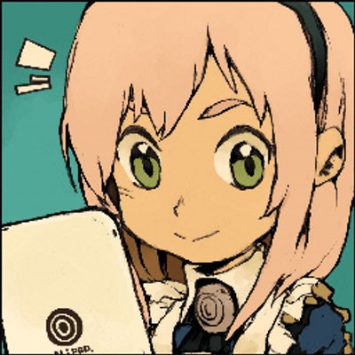
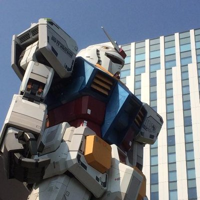
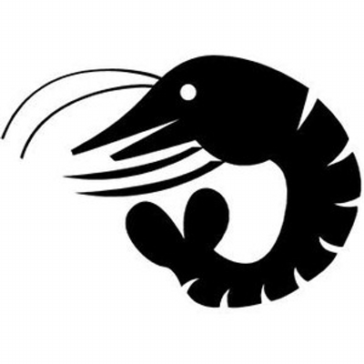
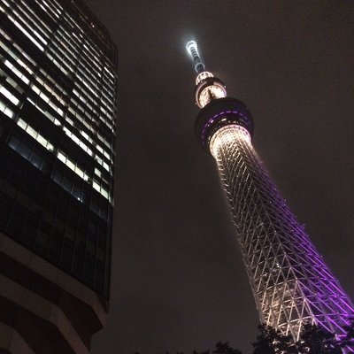
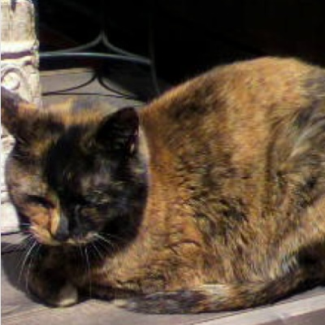
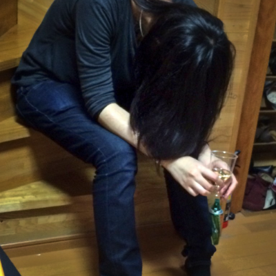
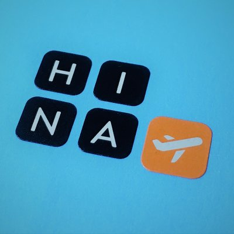
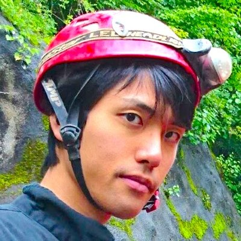
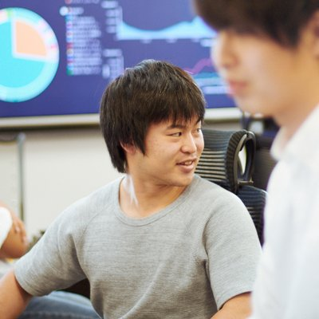
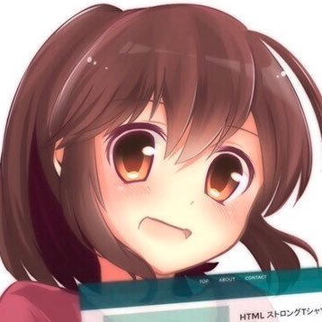

# 企画・編集

    
    

        

            <b>親方 </b>
            <a href="https://twitter.com/oyakata2438">X@otakata2438</a>
        

        

            サークル名：親方Project
        

    

ワンストップ本シリーズ企画・編集（一部執筆）してます。コミケと技術書典に出没。ついに技術書同人誌博覧会（技書博）のコアスタッフとして運営側に参加。技術書イベントが増えて嬉しいけれど、イベント多すぎて外出チケットと徳が不足気味。徳を貯めるべく、家事をこなしつつ、ラボに遊びに行ったり、飲み会や懇親会で著者を新規開拓したり。著者募集はいつでもやっていますので、ぜひご参加ください。

# 著者紹介

    
    

        

            <b></b>
            <a href="https://twitter.com/higuyume">X@KANE</a>
        

    

情報発信をベースに間接的にエンジニアを応援する人！ 人の成長や充実を真剣に考えてます。Podcastを複数配信していることで有名になってきました。

    
    

        

            <b>FORTE（フォルテ）</b>
            <a href="https://twitter.com/FORTEgp05">X@FORTE</a>
        

    

SIerからWeb系に転職し、いまはスマホアプリの開発をしているITエンジニア。Twitter、ブログ、Podcast配信、数多くの趣味と楽しく活動中。Podcastの楽しさをさらに広めるため、Podcastを始める人が増えて楽しいPodcastを増やすため、何よりも自分が楽しいのでPodcast本を生やしました。　

    
    

        

            <b>えびちき</b>
            <a href="https://twitter.com/ebichiki">X@えびちき</a>
        

    

IT企業で働くママエンジニアです。福島のITスキルアップコミュニティ「エフスタ!!」の運営スタッフをしています。福島から東京の会社に転職してからは、移動手段が車から電車や徒歩に変わりPodcastを聴く機会が増えました。通勤や家事をしながらPodcastを楽しんでいます。　

    
    

        

            <b>きり丸</b>
            <a href="https://twitter.com/nainaistar">X@きり丸</a>
        

    

SIerのウォーターフォールを経験したのちに、転職してアジャイル開発を楽しんでいる最中のアプリエンジニア。サボり癖があるので、勉強会に行くことで色んなことを吸収しています（しているつもりです）年に1回くらいのペースですが、ゆるゆるとよさこいでどこかに出没してます。

    
    

        

            <b>寺田直和</b>
            <a href="https://twitter.com/naokazu\_terada">X@寺田直和</a>
        

    

千葉の小さなデザイン会社KARAPPO（https://karappo.net）の共同設立者です。元々デザイナー兼エンジニアでしたが、今は開発をメインで担当しています。デザインとプログラミングの力で解決できることは何でもします。ウェブ案件ではWordPressやSSGを使うことが多いです。何か役に立つツールを作ることが好きです。現在、弊社では一緒に働く仲間を募集中です。デザインと開発両方に興味があり、弊社の過去の実績や考え方をご覧いただいて共感していただける方はぜひ一度お話しましょう！採用情報ページ：(https://karappo.net/news/recruit/2019/)

    
    

        

            <b>koheisg</b>
            <a href="https://twitter.com/koheisg">X@koheisg</a>
        

    

普段はRuby on Railsを中心としたフリーランスのエンジニアをやっています。フリーランスのエンジニアはリモート作業も多いので、podcastは心の友です。podcast好きがワイワイ話してるnoracastもぜひお聞きください。

    
    

        

            <b>みずりゅ</b>
            <a href="https://twitter.com/mzryuka">X@みずりゅ</a>
        

    

のんびりごろごろ、ネコ、うさまる、技術の話は大好きです。SIerですがアジャイルな開発も経験していたりします。
最近は思うところもあり、色々と活動中。最近のお気に入り言語はGo言語とElixirです。

    
    

        

            <b>S(エス)</b>
            <a href="https://twitter.com/goodengineer7">X@S(エス)</a>
        

    

平日は名古屋でフリーランスエンジニア。ずっとJava・C#でSES客先常駐パターンでしたが、ようやくWeb系の案件（Laravel+Vue.js）に転向できました。週末は鹿が出る岐阜のド田舎で家族と暮らしてます。43歳の時、手取り19万円だったブラック企業を脱出してフリーランスへ。電子書籍で生々しい経緯を無料配布中 http://bit.ly/FSE-FreeEBook

    
    

        

            <b>akazunoma</b>
            <a href="https://twitter.com/akazunoma">X@akazunoma</a>
        

    

寝相が良いWebディレクター。
ドワンゴ、DMM.comなどの様々なWeb企業勤務を経て楽しく暮らす。
口癖は「なんか」と「あの」。

    
    

        

            <b>yyykn</b>
            <a href="https://twitter.com/akazunoma">X@yyykn</a>
        

    

Webの片隅でなにかをつくっています。やっていきましょう。
podcastはたのしいです。
紹介する自己がありません。

    
    

        

            <b>いわしまん</b>
            <a href="https://twitter.com/iwasiman">X@いわしまん</a>
        

    

エンジニア転職戦線がまだSIer対Web系でなく汎用機系対オープン系で語られていた時代、金融系からSIer(たぶん)に転職してサバイブしてきたITエンジニア。会社ではSEだけどほぼソフトウェアエンジニアであり、Webエンジニアぽくもあり、何エンジニアなのかよく分からなくなっています。サーバサイドがメインでアーキテクト的な立ち位置が多いです。2019年はAWSの学習を始めてみました。
皆さんのエンジニアライフが、Podcastと共により楽しくなりますように！

    
    

        

            <b>ひな</b>
            <a href="https://twitter.com/hinahypersonica">X@ひな</a>
        

    

研究者。普段は本とゲームを語りますが、細く長いPodcast聴き専でもあります。Podcast本が生えると知って思わずアンケートに名乗り出てしまいましたが、出処の知れない回答を拾っていただいたことには感謝しかありません。皆様にPodcastの楽しさが少しでも伝わりますように。

    
    

        

            <b>gami</b>
            <a href="https://twitter.com/jumpei_ikegami">X@jumpei_ikegami</a>
        

    

「しがないラジオ」パーソナリティ。
『完全SIer脱出マニュアル』著者。
好きな完全食はCOMP。

    
    

        

            <b>なべくら</b>
            <a href="https://twitter.com/nabe__kurage">X@なべくら</a>
        

    

普段はフロントエンドエンジニアやってます。楽しそうなことには首を突っ込まずにはいられない性格。podcast作ったり、イラスト描いたり、写真撮ったり…物を作ってワクワクしながら生きていきたい！

    
    

        

            <b>zuckey</b>
            <a href="https://twitter.com/ziuckey_17">X@zuckey</a>
        

    

「しがないラジオ」パーソナリティ、編集の人。バックエンドエンジニアやってます。「チーム開発1年目の教科書」著者。本書では数少ないSoundCloud利用者として利用方法を書きました。

    
    

        

            <b>こまっち</b>
            <a href="https://twitter.com/komacchi_u">X@こまっち</a>
        

    

普段は、インフラエンジニア(クラウド・IaaS・セキュリティ)をしております。本書のPodcastにゲスト出演させていただいたりしています。最近は、筋トレ、ファンクショナルトレーニングにハマっています。目指せ筋トレエンジニア！
本書では、コラムを一部書かせていただきました。

    
    

        

            <b>YUSUKE(ユウスケ)</b>
            <a href="https://twitter.com/G_OVER_N_GAME">X@YUSUKE</a>
        

    

北海道在住の二児の父。幼い頃からビデオゲームに囲まれながら過ごす。
Ｘ、Podcast配信などでゲームの楽しさを発信中。

    
    

        

            <b>ふーれむ</b>
            <a href="https://twitter.com/ditflame">X@ditflame</a>
        

    

最近息子が産まれたのでアウトプット力が激減中です(当社比)。アウトプットしていきたい～。

## 表紙イラスト担当

    
    

        

            <b>湊川あい @llminatoll</b>
            <a href="https://twitter.com/llminatoll">X@湊川あい @llminatoll</a>
        

        

            サークル名：湊川あいの、わかば家。 <a href="http://webdesign-manga.com/">http://webdesign-manga.com/</a>
        

    

絵を描くWeb デザイナー。『わかばちゃんと学ぶ』シリーズなどを描いています。
前回に引き続き、表紙イラスト、漫画、一部本文に参加させていただきました。いつもありがとうございます。
マイクにやりすぎない金属感が出せたのと、ワンストップちゃんを生き生きとかわいく描けたのが満足です。裏表紙のちびキャラも注目。

<!-- ページ数調整 -->
 
 
 
 
 
 
 
 
 
 
