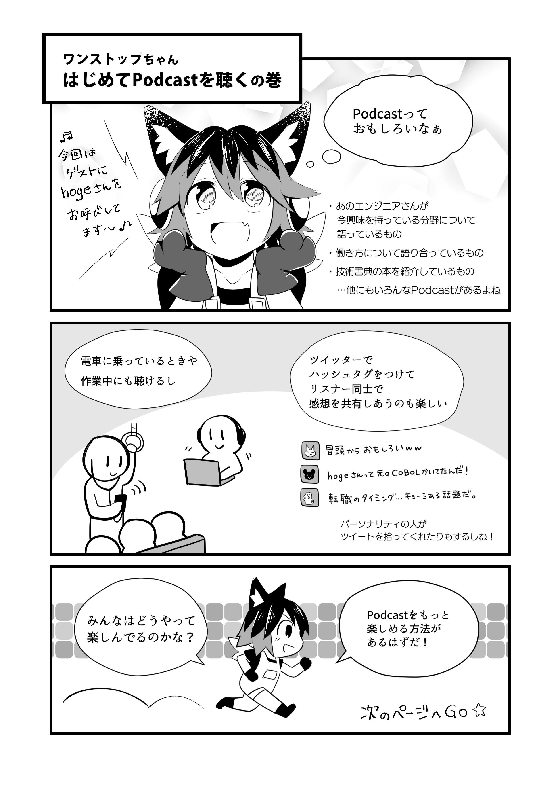
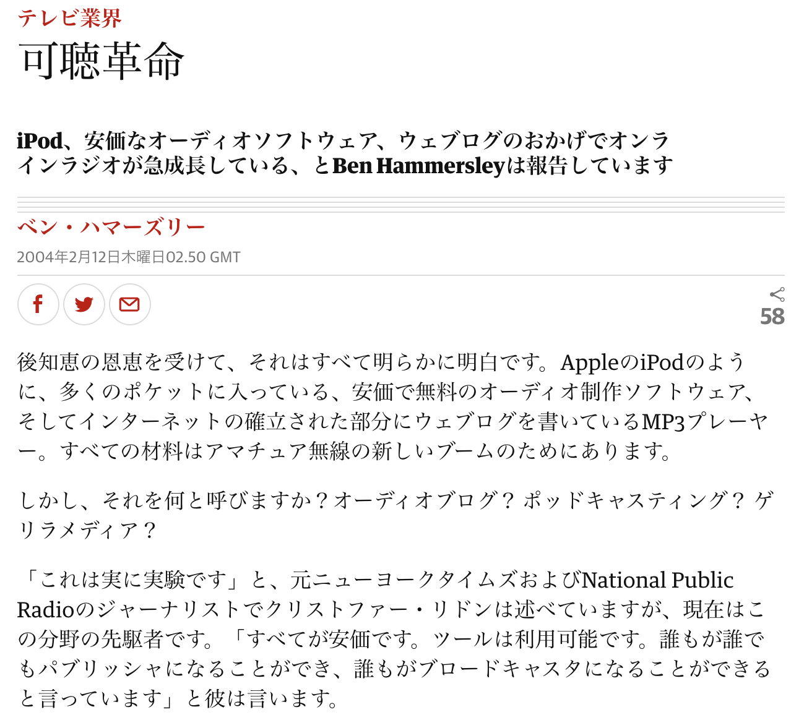
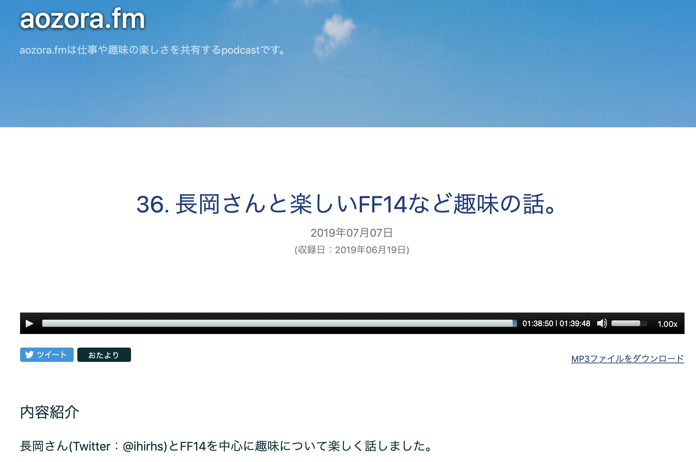

# Podcastとは？
iPhone（iPod）ユーザーの方は自分のホーム画面に紫色の背景に白いアンテナが立っているようなアイコンを見たことがあるかもしれません。またその名前からPodcastはApple社が開発したサービスのように思われますが、実際には異なります。

## 仕組み
Podcastを簡単に説明すると、個人でも配信できる「インターネットラジオ」です。昨今ではブログやSNSで、インターネット上に⾃分の意⾒や⾃分が興味あることを表現するのが当たり前になっています。Podcastはその音声版、つまりラジオということです。内容は自分が好きなこと、知人との雑談、言語の学習、仕事で使う技術の話など千差万別です。その多様性が聴く楽しさ、探す楽しさ、自ら配信する楽しさを感じさせてくれるメディアだと思います。

## 由来
もともとは、2000年6月にRSSという仕組みで音声や映像を配信する仕様として実装されたのが始まりです。RSSでブログやHPの更新情報をやりとりする他に音声などのメディアファイルも配信するために実装されました。このときはPodcastという言葉は存在しておらず、音声のブログということでaudiobloggingと呼ばれていたようです。

### 歴史
ではいつからPodcastと呼ばれるようになったのでしょうか？
それは2004年2月にBen Hammersley（ベン・ハマーズリー）というジャーナリストが新聞に投稿した記事https://www.theguardian.com/media/2004/feb/12/broadcasting.digitalmediaが最初だといわれています。当時は初代iPodが発売されて3年弱ほど経っており、個人がCDやMDではなくMP3データを持ち歩くようになっていました。またフリーのオーディオ制作ソフトや個人ブログの流行などもありました。

そのため、個人によるインターネットラジオが流行っており、ベンはそのことについて書いた記事で「Podcasting」という言葉を使いました。これがPodcastという言葉が誕生した瞬間だといわれています。

ちなみにiTunesにPodcastの機能が追加されたのは、2005年6月のバージョン4.9からだそうです。Podcastを最近知った方、あるいは数年前から知っている方にしても、21年も前から存在しているのは意外に感じるのではないでしょうか？

## なぜPodcastを聴くの？
Podcastを聴く理由は人によって異なると思います。筆者は次のような理由があると思いました。

* 楽しいから
* 面白いから
* 勉強のため

楽しいと面白いは同じような意味合いですが、楽しいは興味深い感じ、面白いは単純に会話が面白くて笑ってしまう感じです。たとえば筆者の仕事であるITエンジニア関連のPodcastや歴史や語学、社会問題など真面目なテーマのときは笑わないですが、楽しく聴いています。面白いPodcastはテーマによらず「あるあるネタ」で盛り上がったり、ネットスラングやユーモアがあるような会話を聴いていると楽しいよりも面白い、という感想が出てくることが多いと思います。

また筆者の周りでは次のような理由を聞くことができました。

* その人の声を聴いてみたい
* その人のことをよく知りたい
* お供（暇つぶし）
	* 家事
	* 通勤電車
	* 運動
	* 寝る前に布団の中で

さまざまな人にPodcastを聴く理由を聞いていくうちに「自分が好きな時に、自分が好きな内容のPodcastを、よい音質で」というのも大きな魅力だと思いました。

## ラジオとの違い
AM/FMラジオは番組表に則って放送されているため、その時間にラジオをつけないと特定の番組を聴くことはできません。最近はradiko（ラジコ）というアプリでだいぶ緩和されてきていますが、それでも制限があることに違いはありません。Podcastではそのような制限はなく、自分が好きな時に好きな番組を聴くことができます。また過去に配信されているエピソードを遡って聴けるのも大きな魅力だと思います。

そして環境によるノイズがなくクリアな音声で聴くことができるのも魅力的です。ダウンロードしてしまえば、たとえ電波が入らない地下鉄の中でもノイズや切断に悩まされることはありません。Wi-Fiでダウンロードすればパケット通信量を気にする必要がないのもよい点だと思います。

## どんなPodcastがあるの？

参考までに筆者が聴いているPodcastのテーマを紹介したいと思います。

* ITエンジニア（Tech系）
	* 技術
	* 経歴
	* 働き方
	* ニュース
	* マネジメント
	* キャリア
	* ザッソウ
* 日本史
* ゲーム
* プラモデル
* 英語
* 音声ブログ
* 声優のPodcast
* 雑談
* 夫婦Podcasthttps://anchor.fm/yahsan2 など、いくつかあります。
* ニュース
* 生成AI
* ビジネス
* コンサル
* 旅

もともとITエンジニア系（Tech系）のPodcast から聞き出したので、Tech系のPodcastが多いと思います。一口にTech系といってもゲストの経歴について掘り下げたり、働き方や転職について会話するPodcastもあります。また人ではなくニュースに着目してTech系のニュースを紹介する番組もあります。

### Tech系以外
Tech系以外ではパーソナリティが興味あるテーマについて話すPodcastを聴いています。日本史、ゲーム、プラモデル、好きな声優さんがやっているPodcast、雑談などです。内容としては最新のニュースやためになる話もあれば、とても懐かしい話題だったり、自分の知らない話題だったりします。そのどれもが自分の興味あるテーマというだけでとても楽しいのです。まるで初対面の人が自分と同じ趣味だと判明したあの瞬間のような楽しさがあります。

他にも夫婦がやっているPodcastも好んで聴いています。ITエンジニアの旦那さんが奥さんに技術の話をしていたり、逆にWebデザイナーなどをやっていた奥さんが旦那さんに技術の話をしているのを聴くのが楽しいです。あるいは夫婦でITエンジニアをやっていて、その会話を聞いたりするのが興味深いです。

自分の興味ある分野で活動されている方が普段どんな生活をされているのか、どんなことに興味があるのか、そんな話題に触れられるのが非常に楽しいと思っています。

　
## 2026年のいまPodcastがアツイ
2025年10月31日に野村高文さんの書籍「プロ目線のPodcastのつくり方」が販売されました。ワンストップPodcastを執筆した2019年～2020年当時では、商業誌でPodcastの本が出るなど考えられなかったことです。

https://book.cm-marketing.jp/books/9784295411482/

また2024年末の技術書典17ではPodcastの技術同人誌が2冊頒布されていましたし、2025年に実施された「ポッドキャスト国内利用実態調査」では全年代利用率で、NetflixやFacebook、雑誌、ABEMAを上回る結果になったそうhttps://prtimes.jp/main/html/rd/p/000000086.000035509.htmlです。

### ショート動画作成者もPodcastへ
Podcastは音声のみで長いメディアですが、対局にあるのが動画で短いメディアであるショート動画です。このショート動画で有名になった方に「ど素人ホテル再建計画」さんという方がいらっしゃるのですが、2026年はPodcastが来ると公言しています。

https://podcasts.apple.com/jp/podcast/2026%E5%B9%B4%E3%81%AFpodcast%E3%81%AE%E6%99%82%E4%BB%A3%E3%81%AB%E3%81%AA%E3%82%8B%E7%90%86%E7%94%B1/id1885150473?i=1000755257314

これはショート動画よりPodcastの方が価値があるという事が言いたいのではなく、この消費社会である現代において、ショート動画すらも消費されてしまい、次はPodcastの価値が見出された始めたのではないか？という事が言いたいのです。

### 流行りに乗る必要はないが、知っておいて損はない
流行るからPodcastを聞け！やれ！というわけではないのですが、インプットにしろアウトプットにしろ様々な手法を知っておいて損はありません。またブログ、登壇、動画、Podcastとそれぞれメリデメや特徴があります。それらを知っておくことで、自分の状況や環境に応じた活用ができるのだと思うのです。
