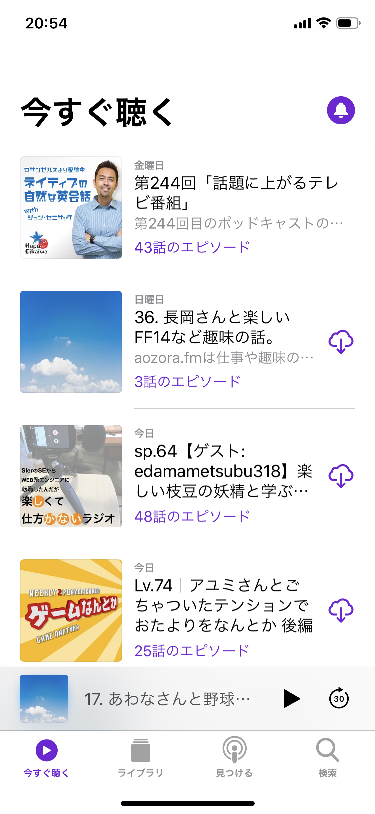
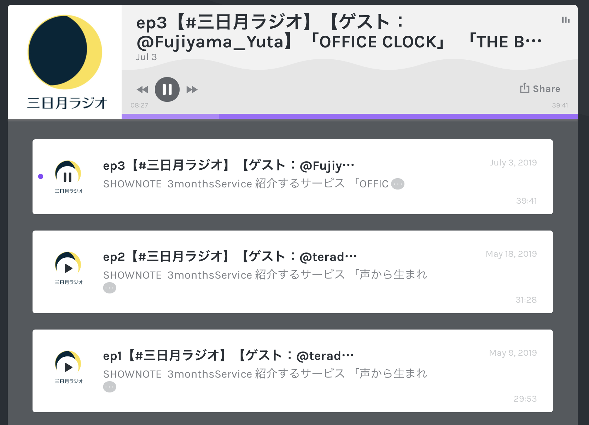
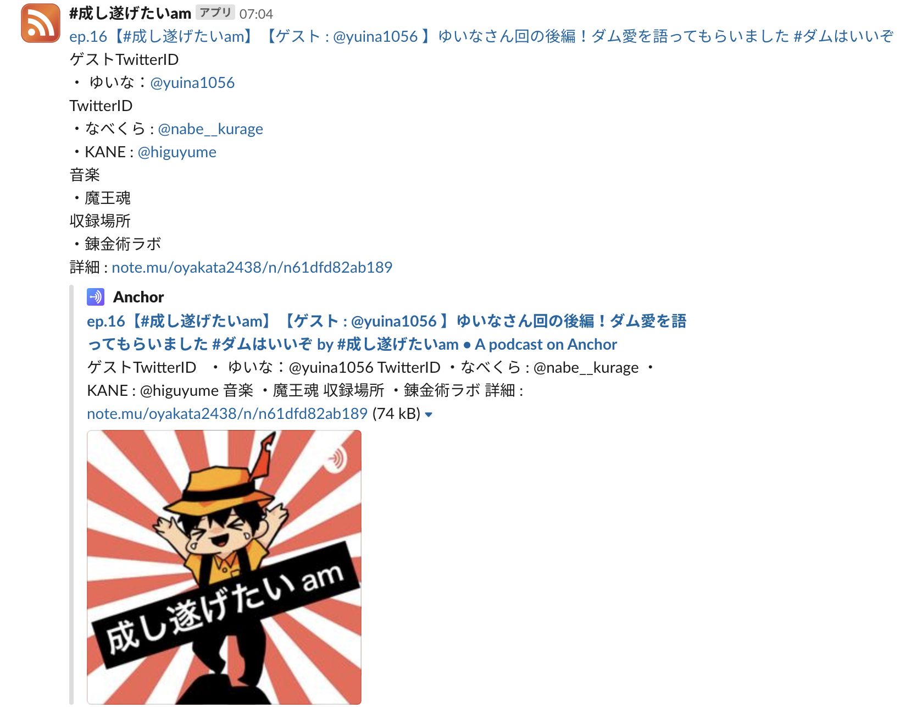
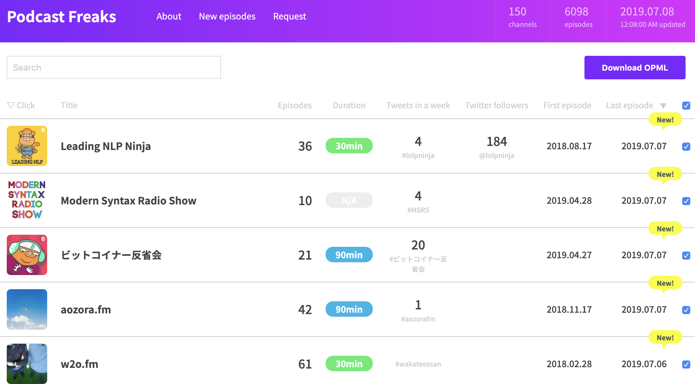

# どうやってPodcastを聴くの？
Podcastはどうやって聴けばよいのでしょうか？代表的な聞き方をそれぞれ解説していきたいと思います。ぜひ自分に合う聞き方を見つけてください。

## iPhoneでPodcastを聴く
スマホで聴く場合はPodcastを聴取するアプリを用いて聴きます。代表的なのはiPhoneに最初から搭載されている「Podcast」というアプリだと思います。このアプリはPodcastの検索、購読、再生などが可能です。

基本的な流れとしては聞きたいPodcastを探す、購読する、再生するの順番です。このアプリにはランキングやテーマといった機能でPodcastを探しやすくなっており、また最新のエピソードが表示されます。ここからよく再生されているPodcastを聞いてみたり、人気があるPodcastを眺めてみるとよいでしょう。



また、最近では、SpotifyもPodcastの再生アプリ/プラットフォームとして非常にメジャーになりました。なんならPodcastのアプリ以上かもしれません。

### 購読
次にPodcastの購読ですが、この購読は無料でできます。購読と聞くとお金がかかるイメージがありますが、Podcastの場合は無料で可能です。この購読をすることによって、最新のエピソードが配信された場合に自動でPodcastをダウンロードしてくれたり、配信を通知してくれたりします。

また購読しておくことによって、いちいちPodcastを検索する手間が省けますし、購読してダウンロードしておくことでオフライン状態でも再生可能になります。設定によっては聞き終わったPodcastを端末から自動削除してくれるので、容量を圧迫する心配は不要です。

### 聴いてみる
気になるPodcastが見つかったり、購読したらタイトルをタップして再生してみましょう。再生時は15秒巻き戻したり、30秒スキップさせたりできます。また再生速度を変えることができるので、たくさん聞きたい時は再生速度を上げると短い時間で多くのエピソードを聞くことが可能です。

他にはスリープタイマー機能があり、指定した時間で再生を止めてくれます。寝る前にセットしておくと再生しすぎずに済みます。

## その他のアプリ
iPhoneの「Podcast」以外にもさまざまなアプリがあります。著名なところでは「Pocket Casts」、「Overcast」などがあります。アプリによって搭載されている機能が違うので、ちょっと不満点があったり、こういう機能が欲しいなぁと思ったら試してみるとよいと思います。

また、Podcast番組によっては自番組専用のアプリを作成している場合があります。過去のエピソードを簡単に再生できたり、番組へのお便りが簡単に出せたりとその番組をより楽しむための機能が搭載されています。お気に入りの番組が専用のアプリを配信していたらぜひチェックしてみましょう。


## AndroidでPodcastを聴く
AndroidにはiPhoneのようにデフォルトのポッドキャストプレイヤーアプリがありません。よって、他のアプリ同様、自分でGoogle Play ストアからダウンロードしてくる必要があります。Androidが登場した黎明期には、使いやすいポッドキャストアプリが少なく、数百円程度の有料アプリを購入するのが一般的でした。

### AndroidでのPodcastアプリ
ですがここ最近は、無料でも高機能なポッドキャストアプリがいくつか存在しますので、好みに合わせて選択できる状況になっています。さらには、たとえば再生時にユーザーの好みに合わせたオーディオエフェクトが設定できるなど、機能的にも段々と高度になっており、「どのアプリがよいか？」については選択が難しくなっています。

ある程度継続して開発が行われている、著名なアプリを２つほど紹介してみます。他に有料アプリ等もありますが、無料で使い始められる、このどちらかを選べば、大きくはずす事はないでしょう。（2019年時点の情報を記載しています。アプリの進化が早く、サービス内容や金額などが変わっている可能性があります。）

### Podcast & Radio Addict

https://play.google.com/store/apps/details？id=com.bambuna.podcastaddict

無料版はアプリ内広告があり、有料版（Podcast Addict - Donate という名称の別アプリ。約400円の課金が一回のみ発生します。）を購入することで広告なしで利用できるタイプのアプリです。音量ブーストや倍速再生など基本機能もそろっており、頻繁にアップデートが行われています。Webサービス等はなく、スマホアプリのみで完結しているため、機種変更時には購読番組のバックアップ＆リストアが必要になります。

### Castbox

https://play.google.com/store/apps/details？id=fm.castbox.audiobook.radio.podcast

無料版はアプリ内広告があり、100チャンネルまでしか購読できません。有料版（年額1,680円の定期購入）を購入すると広告なしでチャンネル購読数が無制限となります。Castboxのサービスサイトでアカンウントを作成することで、複数のスマホ端末やWeb版サービス間で連携が取れます。

<div class="column">
<div class="column-title">入浴しながらPodcastを聴く＠みずりゅ</div>


Android端末でPodcastを聴くメリットの一つに、ほとんどの機種が「防水」であることが挙げられます。
私はこの防水である点を利用して、お風呂で湯船に浸かりながらPodcastを聴いていました。

Podcastの良いところはインプットが「耳」である点です。通常のインプットに利用している「目」は、普段の生活や書籍／PC等によって睡眠以外は休む間も無く活動しています。入浴中に目を瞑りながらPodcastを聴く。こうすることで、疲労している「目」を休ませながらインプット活動を入浴中にすることができるのです。

とはいえ、Podcastの中には1時間を超える番組もあります。面白さに集中しすぎてのぼせないように注意しましょう。適度な入浴が大切です。

それと、非防水のスマートフォンを防水ケースやジップロックなどのファスナー付きプラスチックバックに入れて利用することもできます。
ですが、万が一を考えると、怖い思いをしないように防水のスマートフォンを利用するのが良いでしょう。Android端末の場合は、中古品であれば一万円以下で買うこともできます。

メイン端末とは別に、入浴時に使う端末を購入するのもありです。動画とは異なり、容量の少ない端末でもPodcastなら入浴一回分の番組は保存しておくことができるでしょう。

</div>

<div class="column">
<div class="column-title">講演やセミナーをmp3に変換して聴く＠S（エス）</div>
YouTube等で面白そうな講演やプレゼンの動画を見つけたとき、あとでポッドキャストアプリで聴くようにしています。１時間を超えるものが多く、動画を見続けるのは辛いのと、多くの場合はビジュアルは必要なく、耳から聴くだけの方が集中してインプットできるためです。

YouTubeのURLから、Any Video Converter（無料版） や「YouTube mp3 変換」で検索すると出てくるようなWebサービスを用いて、動画をmp3ファイルに変換します。（この手のアプリケーションには、不要なバンドルソフトが同梱されていたり、またWebサービスでは、mp3ファイルのダウンロードと同時に怪しいサイトが表示されたりする可能性がありますので、十分ご注意の上ご利用ください。）

本編で紹介されている Podcast & Radio Addict の「仮想ポッドキャスト／オーディオブック」機能を使うと、特定のフォルダをポッドキャストの配信チャンネルに見立てることができます。新規チャンネル追加時に仮想ポッドキャストを選択して、フォルダを指定すると、以後このフォルダにファイルが追加されるたびに、ポッドキャストアプリが「新しいエピソードが配信された」ものとして検出してくれます。

ポッドキャストとは少し異なりますが、「自分で音声コンテンツを用意し、ポッドキャストアプリを使ってスキマ時間にインプットする」というのも面白い使い方ではないでしょうか。いくつかYouTubeに上がっている面白そうなコンテンツを紹介してみますので、試してみてください。

 * ウメハラ「BeasTV」 一日ひとつだけ強くなる 慶應丸の内シティキャンパス講演
	* 世界的に有名な日本のプロゲーマー、梅原大吾さんの講演。
	    * https://www.youtube.com/watch？v=fS4SKgzKawI
 * ホリエモン＆落合陽一「働き方」パート１
    * 言わずと知れた著名なお二人の対談。
	    * https://www.youtube.com/watch？v=4CyuZ5Jr34Y
 * ちょまどさん 基調講演（Edu×Tech Fes 2019 U-18）
    * 文系出身エンジニア兼マンガ家、ちょまどさんの「私の分岐点」をテーマにした講演。
	    * https://www.youtube.com/watch？v=xgzotHfjSq8
</div>

## PCで聴く
PCでPodcastを聞く場合はその番組名で検索してみるとよいでしょう。配信しているサービスによって見た目や機能は異なりますが、再生する分には十分です。ただしアプリと違って購読する機能や最新エピソードの配信通知などはありませんので、自分で用意する必要があります。筆者はPodcastをPCで聞いているので、一例としてその環境を紹介したいと思います。



### Podcastの配信通知を受け取る
聞きたいPodcastがひとつふたつであれば聞きたい時にサイトに行って配信の有無を確認すればよいですが、番組数が増えてくると更新確認をするだけで面倒です。Podcast自体はRSSで配信されているので、RSSリーダーと呼ばれるソフトであれば配信通知を受け取ることが可能です。

#### Slack（スラック）
筆者はSlackというチャットツールをよく使っているので、Slackに対してPodcastの配信通知を飛ばすようにしています。Podcastの配信サイトは必ずRSSを配信しているはずなので、そのURLを取得すればSlackで通知を受信することができます。



ですが、RSSのURL取得方法はサイトによって異なります。概ね次の方法で取得できると思います。

* ページ内のリンクから取得する
* 外部サイトを利用して取得する

ページ内のリンクから取得できる場合は特に手順が不要なので非常に簡単です。外部サイトから取得する場合は次のサイトで取得可能です。

http://getrssfeed.com/

これらでも取得できない場合はサイトのHTMLソースから取得しないといけないので、ちょっと面倒です。Google Chromeでの手順としては対象のページを表示したら、右クリックして「ページのソースを表示」をクリックします。そこから次のようなRSSのURLを探します。このhrefの部分が目的のURLになります。

```html
<link rel="alternate" type="application/rss+xml"　href="https://fortegp05.github.io/aozorafm/feed.xml">
```

SlackでこのRSSの更新通知を受け取るには次のコマンドを実行します。

```
/feed subscribe https://fortegp05.github.io/aozorafm/feed.xml
```

これでSlackのワークスペースに対象のPodcastの配信が通知されるようになります。

### PCで聴くメリット
筆者は再生環境やアプリにこだわりがないのでそのPodcastの配信サイトでそのまま聞いています。しかし、PCであれば配信サイトで再生する以外にも、MP3ファイルをダウンロードして好きな再生ソフトで再生することが可能です。またプレイリストとして編集することも可能なので、スマホに比べれば再生環境の自由度は高いと思います。PCを経由すればPodcastに対応していない機器から再生することも可能です。

たとえば、CDなどに焼けばBluetoothやAUX接続などがないカーオーディオからも再生できるでしょう。Podcastに対応していない環境でも再生可能にできるのはスマホにはないメリットだと思います。他にもダウンロードしてオフライン環境で聞くなど、再生環境を柔軟に構築できるのがPCで聴くメリットだと思います。


## どう探せばいいの？
Podcastにはたくさんの番組があります。これまでにも簡単に触れてきましたが、Podcast番組はどうやったら探せるのでしょうか？いくつかの方法を紹介したいと思います。

### ググる
もっともポピュラーな検索方法です。「好きなワード + Podcast」で検索してみましょう。たとえば「ゲーム Podcast」で検索すると執筆時点で約3,520,000件がヒットしました。この全てがPodcast番組ではないですが、数多くの情報が存在するのが分かると思います。筆者も実際に検索して聞くようになった番組がいくつかあります。

ここからひとつひとつ見ていくのも楽しいですが、面倒!という方もいるかと思います。そういう場合はまとめた記事やサイトを利用しましょう。ジャンルごとに必ずそういったまとめ情報があるわけではありませんが、情報が多い場合は需要があるのでまとめサイトがある可能性は高いでしょう。逆に情報が少ない場合は全部チェックしたとしてもそれほど大変ではないので実際には問題にならないでしょう。

### Podcast Freaks
日本語のTech系Podcastのまとめサイトとして「Podcast Freaks」をご紹介したいと思います（2026年現在は更新されていませんが、過去の番組やエピソードを閲覧することは可能です）。URLは次のとおりです。

https://podcastfreaks.com/

「Podcast Freaks」は日本語のTech系Podcastを登録して更新情報などを一覧表示してくれるサイトです。「noracast」というPodcastのパーソナリティが作成したサイトで、Podcastの一覧表示のほか、配信情報の表示や、Podcastをスマホにそのまま登録できるファイル（OPML）のダウンロードなどが可能です。

Tech系Podcastを聞きたいという人はぜひ「Podcast Freaks」を使ってみてください。お気に入りのPodcastが見つかると思います。



### 海外のPodcast番組を探すにはどうする？
Podcastが海外でも人気なのはいうまでもありません。Podcastクライアントアプリに備わっているブラウズ機能を使えば、検索でヒットする多くの日本語Podcast番組に交じって、海外の番組もいくつか見かけることができます。新聞やラジオ、テレビといった従来のメディアを取り扱う法人は数多くありますが、そうした法人がPodcast向けにもコンテンツを配信しています。これは日本だけでなく、海外でもまた同様の状況といえます。気になっている海外のメディアがあれば、Podcast番組も配信していないかチェックしてみましょう。

#### 海外のPodcast文化
一方で日本ではあまり見られない形態として、海外ではPodcastを専門に制作・配信する法人が存在します。たとえば、最近のSpotifyによる買収で話題となったGimlet Media<span class="footnote">https://gimletmedia.com/</span>、それにPodcastクライアントアプリ「Overcast」の開発者Marco ArmentがPodcastを配信しているRelay FM<span class="footnote">https://www.relay.fm/</span>などが挙げられます。

こうした法人は数多くの、かつ色々なジャンルのPodcast番組を配信していますので、これらを起点に番組を探してみるのもよいでしょう。

#### 独自プラットフォームの番組
このような配信プラットフォームで配信されない、もしくは配信されていたとしても、ランキング上位に上がってこないようなニッチな番組をお探しであれば、それはなかなか険しい道といえるでしょう（これは日本のPodcastでも同様ですね）。地道にインターネットを巡回していく他に方法はなく、探すには相応の根気と時間が必要になりますが、そのぶん自分にとって「これだ！」と思えるような番組を見つけられたときの喜びはひとしおです。

<div class="column">
<div class="column-title">感想ツイートした人の聴いた番組を聴いてみる@みずりゅ</div>
口コミ...と言って良いのかはわかりませんが、ハッシュダグ付きでPodcastの感想ツイートをしている方をフォローしてみてはいかがでしょうか。

感想をツイートされる方は、別のPodcastを聴いても同じように感想をツイートしている可能性が高いです。

その感想ツイートをみて興味を持った番組を聴いてみるのはどうでしょうか？
</div>
