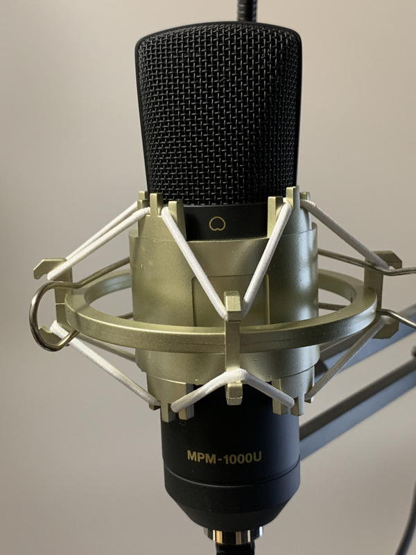
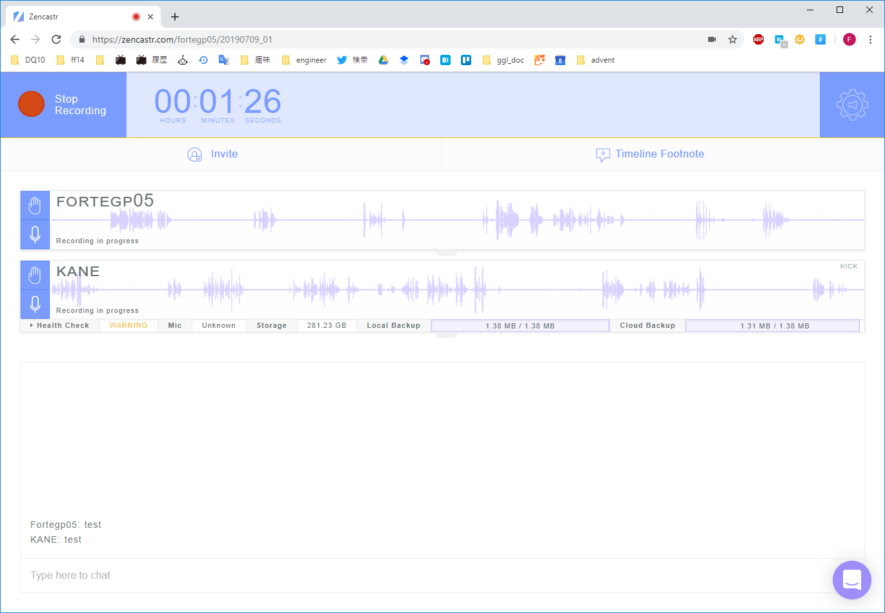
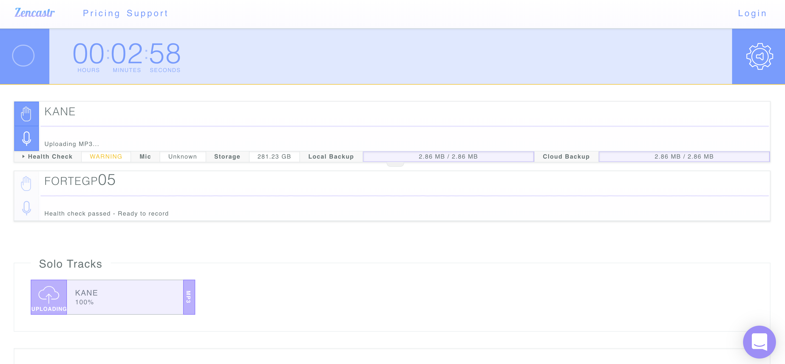
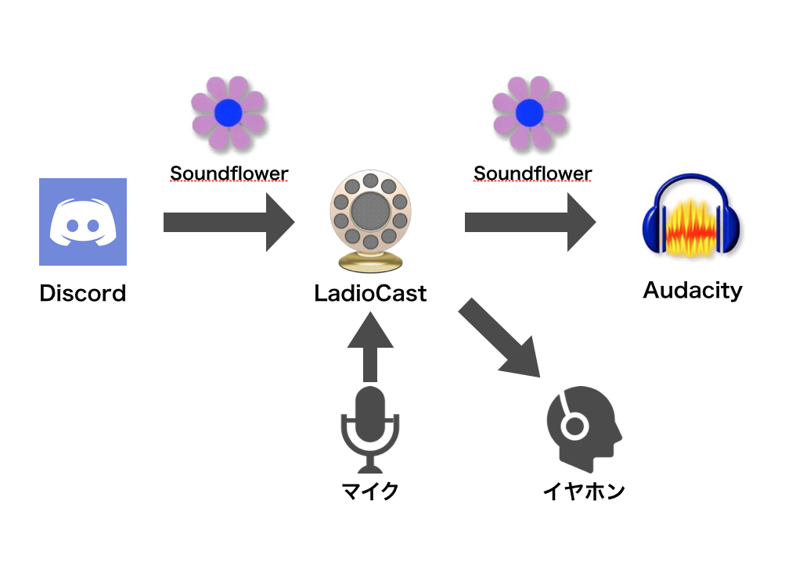
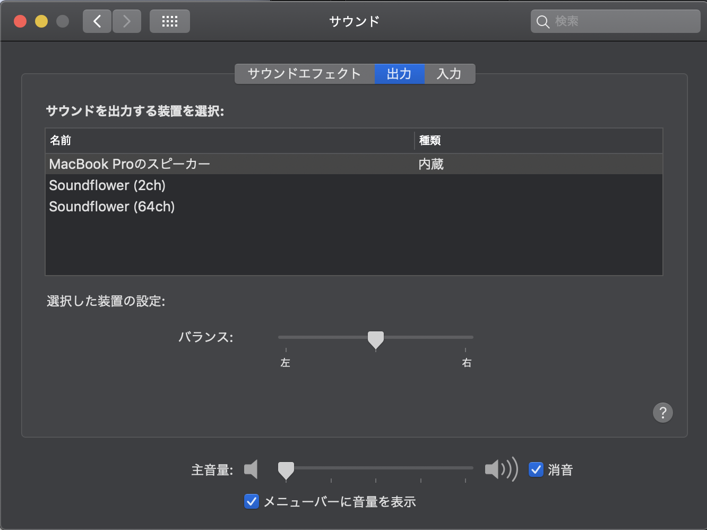

# 録音
Podcastの収録には録音機材が重要です。iPhone付属のイヤホンマイクと1万円以上のマイクでは音質に雲泥の差があります。ですが、音質以外の観点ではiPhone付属のイヤホンマイクにもメリットがあります。また、入力インターフェースであるマイク以外に録音ソフト、ミキサーなどが録音機材にあたります。それぞれ見ていきましょう。

## マイク

録音するにはマイクが必須です。マイクの値段はピンキリですが、筆者が使用したことがあるものをいくつか紹介したいと思います。ちなみに筆者は単独のときはマランツ MPM-1000U、複数人のときはBlue Yetiを使用しています。

### イヤホンマイク

何かを始める時、それにかかるお金は非常に気になるものです。できるならタダで始めたいでしょう。Podcastもお持ちのスマートフォン付属のイヤホンマイクで始めることができます。しかし、イヤホンマイクを使う時はいくつか注意点があります。まずはタッチノイズと呼ばれるマイク本体やケーブルが衣服と擦れることで発生するノイズです。特に誰かと会話する形式のPodcastの場合、会話しているテンションが上がったり、身振り手振りなどが原因で発生しやすいノイズです。これはなるべく動かないように意識するか、クリップなどで体に固定してしまうしかありません。

またイヤホンマイクの場合は吐息などによるブレス音や破裂音(パ行の音)なども発生しやすいので気をつけましょう。できるなら手でマイク部分を持って、口の横からなるべく動かさないようにすると良い音質になると思います。長時間の収録は大変ですが、その分安価で済むというメリットがあります。

とはいえ、PC本体のマイクよりよっぽどよいのでぜひ使いましょう。

### ヘッドセット

ヘッドセットは安価なものであれば千円くらいで買えるのが魅力的です。イヤホンマイクと違い頭部に固定できるため、タッチノイズが発生することはありません。ですが、マイクが口に近づくため、ブレス音や破裂音が非常に入りやすいです。また筆者が試した製品では、感度が高いためブレスノイズを拾いやすいイメージがあります。

ヘッドセットを使用する場合はマイクの位置を調整して録音テストをするのが大事だと思います。ブレス音などのノイズはマイクを口の横に持ってくると軽減できる場合があります。声が入りづらくならないように気をつけて位置を調整しましょう。

### マランツ MPM-1000U

筆者オススメのマイクです。ちなみに一人用のマイクです。このマイクはTCFMhttps://turingcomplete.fm/でも使われているマイクです。値段としては本体が約7,000円、マイクを固定するアームが約3,000円ほど、合計1万円ほどで自宅に快適な録音環境が構築できます（2019年当時）。

このアームには風防がついており、ブレスノイズを軽減できます。またアームによってノイズが入りづらい位置にマイクを固定でき、リラックスした姿勢に合わせやすいため長時間録音しても疲れにくいです。

{width=30%}

実際に筆者は休憩を挟みつつですが、1日に5時間弱の録音をこなした経験があります。そしてこのマイクは指向性が強く、空調のノイズを拾いにくいようになっています。そのため、別の方向からならエアコンの風などのノイズが拾いにくいようになっています。マイクの指向性が高いことと、アームで口元に持ってくることができるため、非常に良い音質で録音できます。

ちなみにこのマイクはUSB接続であるため、接続も簡単です。筆者は最初にヘッドセットを使っていましたが、比べ物にならないくらいノイズが少なく良い音質で録音できるようになりました。音質が良いと編集が非常に楽になるので、多少高価なマイクを買っても満足度は高いと思います。

### マランツ MPM-2000U

### Blue Yeti

最後に集団で録音するときにお勧めのマイクを紹介したいと思います。Blue社のYeti（イエティ）というマイクです。このマイクはおよそ1万6千ほどとかなり高価ですが、その分高性能かつ楽に録音できます。YetiはUSBマイクなので、USBをPCに接続するだけで使用可能です。一点だけ注意なのが、接続した直後はミュート状態なのでミュートボタンを押して解除するのがポイントです。

{width=30%}

このマイクは本体のつまみを操作して指向性や録音レベルを変えられます。指向性を変えられるというのは、1方向のみ、左右、対面、全方位の4パターンの方向からの音を録音するようにできます。そのため、二人のときは対面にする、複数人の時は全方位にする、一人の時は1方向にするのようにその時に最適な録音状態にできます。指向性が広がるとノイズを拾いやすくなるので、こういった調整ができるのは良い音質の録音をするために非常に便利な機能です。

## 録音ソフト

PCで録音するにはマイクの他に録音ソフトが必要です。筆者は録音、編集ソフトとしてAudacityを使用しています。Audacityはフリーで録音、編集ができるソフトです。録音時は録音レベルを調整することができ、マイク側で調整ができなくてもある程度ならソフト側で調整できます。

## 収録環境を整える

方針とテーマが決まったら次は収録の準備です。ゲストまたは相方がいる場合には、日程調整は忘れないようにしましょう。ここでは、主に収録環境(収録ソフト)と収録場所について述べます。

 * 収録環境を構築する
     * オンライン収録
         * Mac
         * Windows
     * オフライン収録

### オンライン収録環境の準備
収録環境は、オンラインかオフラインかで大きく変わっていきます。
オフラインは、一人または二人、あるいはそれ以上が**対面で**収録する場合です。オンライン収録は、オンラインチャットを録音するイメージで、対面ではなく**ネットを通じて**収録を行うことを指します。

まずオンラインの場合ですが、オンラインの場合はゲストと会話を行うソフトが収録環境となります。よく使用されるソフトは次のとおりです。

 * Discord
 * Skype
 * Zencastr
 * Zoom

いずれもオンラインで相手と会話することができるソフト（サービス）です。これに録音する用のソフトを組み合わせて収録します。どのソフトもオンライン会話ができるので録音自体はどれでも可能です。ただし、音質や使い勝手などは異なります。例えばアカウントの要否、というものがあります。Zencastrはパーソナリティ側のアカウントは必要ですが、ゲストで参加するだけなら名前入力のみで収録可能です。他の3つは先にアカウントを作る必要があります。もしそのソフトをPodcastの収録でしか使わないのであれば、ゲストがアカウントを作るのが面倒と感じてしまうかもしれません。そのため、ゲストに対してアカウントが不要なサービスは収録のハードルの高さを下げていると思います。

#### 他の観点
他の観点として音質やレイテンシ（遅延）というものがあります。ソフトによっては手軽さを重視しているため音質はそこそこだったり、設定によって音質が劇的に変わることがあります。音質が気になる人はなるべく音質が高いソフトを使用すると良いと思います。またオンラインで収録する都合上、どうしてもお互いの会話のやりとりにちょっと遅延が発生してしまいます。テンポの良い会話を重視する場合は遅延も気にした方が良いでしょう。

#### ゲスト側での録音
あとは録音の仕組みを考える必要があります。オンラインでパーソナリティ側にしか録音環境がない場合は、パーソナリティとゲストの両方をパーソナリティ側で録音する必要があります。その場合、自分のマイク入力とゲスト側の音声をそれぞれ録音する必要があります。多くの場合、録音は一つの入力にしか対応していないので別のツールで音声をまとめる必要があります。詳細なやり方は後述します。

ゲスト側でも録音する場合はゲスト側に録音環境を作る必要があるので、その説明が必要です。音質は良くなると思いますが、準備は大変ですし、ゲスト側の録音忘れなど確実性は下がると思います。

#### おすすめの録音環境（2019年）
さて、筆者のお勧め環境をお伝えしたいと思います。筆者がオンラインで収録する場合のお勧めはZencastrです。理由として、パーソナリティもゲストも手軽、それぞれに音声ファイルがダウンロードできる、バックアップとして利用できるというものがあります。

まず、Zencastrを使うとパーソナリティもゲストも手軽です。パーソナリティ側としてはURLをゲストに通知すれば他に説明不要なのが良い点です。他のソフトではそのソフトの使い方を知らないと、アカウント作成から説明する必要があります。Zencastrは説明するとしても名前入力とマイクミュートくらいですし、筆者が収録している限りではマイクミュートの説明のみで十分です。ゲスト側からすると余計なアカウントが増えることがなく、操作方法なども特に覚える必要がありません。

またゲスト側で録音して録音録音終了後にファイルをパーソナリティ側に送る仕組みなので、特に説明などせずにゲスト側で録音することが可能です。インターネット環境に左右されずに録音されるので比較的綺麗な音で録音可能です。録音自体はそれぞれのPCで行いますが、最終的にZencastrのサーバーに音声ファイルがアップロードされます。そしてパーソナリティだけがそのデータをダウンロードできる仕組みとなっています。そのため、Zencastrのサーバーにデータが残るので万が一パーソナリティ側のPCにトラブルがあっても再ダウンロードすることが可能です。

そんなZencastrにもデメリットはあります。オンラインということで収録した音声データがパーソナリティ側とゲスト側でズレが発生していることがあります。また無料アカウントでは月に8時間までしか録音できない、などの制限があります（2026年では無料で録音やダウンロードができなくなった）。この制限は有料アカウントにすると撤廃できますが、金額が執筆時点で月額20ドルと少し高めの値段となっています。

#### 自分似合った環境を

それぞれのソフトに長所短所がありますので、**パーソナリティである自分が最も重視している点に合致するソフトを選択する**と良いと思います。筆者が最も重視しているのはゲストがPodcast収録に感じるハードルの高さを下げることです。そのため、アカウントを作らなければならないようなサービスではなく、ブラウザでアクセスすればすぐ録音できるZencastrを使用しています。

いずれのソフトも無料で使えますので、自分の要望にあったソフトを探してみてください。

オンライン収録をやってみて感じたこと@FORTE

オンライン収録でゲストとお互いに自宅で収録をする場合は空調、椅子の音、キーホードのタイプ音、マイクに触れてしまうなどのノイズが発生しやすいです。ですが、どれも気をつけていれば大丈夫なので収録前に念押ししておくとこういったノイズは軽減しやすいと思います。
事前に確認しておいたほうがよいこととしては、近くに工事現場や公園がある、選挙期間中などが考えられます。これらは時間帯を工夫すれば回避できることがあります。工事現場、公園での活動、選挙活動のいずれも夜は行われないことがが多いので早朝や夜に収録することで影響を回避できます。逆に24時間騒音が出ている場合は収録場所を見直したほうが良いかもしれません。

オンライン収録でお互いに自宅で収録すると逆に意図しない音が入ることがあります。小さいお子さんの声だったり、ペットの鳴き声などがそうです。もちろんノイズになる場合は消したほうが良いですが、aozora.fmではお子さんの声が効果的に働いたので残したことがありますhttps://fortegp05.github.io/aozorafm/episode/14 14. まみーさんと語る楽しい働き方の話。。そのときはITエンジニアとしての働き方について会話しており、ちょぅど家族の話をしているときにお子さんの声が入ったのでゲストさんに許可を得てそのまま配信しました。楽しそうなお子さんの声は働き方に関する話題の大きな説得力になったと思います。

#### Macでパーソナリティ側でのみオンライン収録環境を作る（2019年）
前述した通り、オンライン収録でパーソナリティ側でのみ録音する場合はいろいろと準備が必要です。ここではその準備を説明していきます。なお、この手順はMacでのみ有効な手順であり、バージョンは「macOS Mojave 10.14.5」で確認しています（2019年当時の内容です）。

まず、以下のツールを使用します。

 * SoundFlower
 * LadioCast

SoundFlowerは仮想的にサウンドデバイスを増やすことができます。これは通常であれば出力先がスピーカーやヘッドホンしか選択できないところを、コンピュータそのものを出力先として指定することができます。これによりコンピュータ自体に音声を保存したり、別のソフトに音声データを橋渡しすることが可能になります。

LadioCastはいわゆるサウンドミキサーです。このソフトを使うとコンピュータで再生しているBGMにマイクで入力した自分の声をミックスすることができます。

このふたつを使用した環境は次の図のようになります。

なお、LadioCastを使用する際は**必ずマイクやヘッドフォンを接続した後にLadioCastを再起動してから**収録するようにしてください。Macのサウンドドライバの仕様なのか、スリープしたりマイクやヘッドフォンを抜き差しするとLadioCastが正しく機器を認識できない場合があります。

つまりSoundFlowerとLadioCastを使えば、Skypeから流れてくる相手の声に自分の声を乗せることができます。そしてそれを録音すれば、オンラインでパーソナリティ側でのみ録音することができます。

まずSoundFlowerは以下のサイトからダウンロードできます。ご使用のMacのバージョンにあったdmgファイルをダウンロードしてください。

https://github.com/mattingalls/Soundflower/releases

dmgファイルを実行してappフォルダにドラッグしてインストールします。

次にLadioCastはMac App Storeからダウンロードしてインストールできます。

https://itunes.apple.com/jp/app/ladiocast/id411213048

次にMacの環境設定からサウンドを選択し、最下部にあるメニューバーに音量を表示にチェックします。環境設定を閉じてメニューバーに表示されたスピーカーアイコンをoptoin + クリックします。出力装置はSoundflower64ch、入力装置はSoundflower2chを選択します。LadioCastを起動して入力1をSoundflower2chにしてメインとAUX1を選択します。入力2をマイクにしてメインのみ選択します。出力メインはSoundflower64chにして、出力Aux1は外部ヘッドフォンにしておきます。

これでMacで再生されている音声(Skypeなどで相手が喋っている音声)と自分がマイクに向かっている音声をmixできたので、あとはこれを録音するソフトで録音します。

#### Windowsでパーソナリティ側でのみオンライン収録環境を作る
MeetなどとOBS Studio

### オフライン収録環境

オフライン収録環境は「場所」が大事になります。

具体的な要望としては、反響が少ないとか、人の出入りが無い、などが期待されます。その結果、会議室(社内、レンタル)、コワークスペース、カラオケボックス、その他が会場の候補となります。

場所については、音質にどこまでこだわるか、関連して編集作業をどこまで楽にするか、この2点が考えるポイントとなります。極端な話、まったく音質にこだわらなければ声を出せる環境であればどこでも収録できます。たとえば空調の音が入っていようが、工事の音が入っていようが、他人の会話が入っていようが収録可能です。音質にこだわり始めると考えるべき点が増えていきます。

まず収録環境として考えられるのが、カラオケと貸し会議室だと思います。カラオケは声が出せますが、音が響くようになっているためPodcastには向きません。貸し会議室は値段と立地の問題が解決できれば良いと思います。会議室の需要が高まる平日の夜や土日の午後は値段が高い傾向があるため、相対的に安い平日の朝などはお勧めです。また、立地の観点からは、近くに線路や大きな道路があると電車や車の音がはいるため、なるべく静かなところだと良いでしょう。会社の会議室などで録音することも可能ですが、意外と他の会議室への出入りや外でしている会話が入ることがあります。ある程度は編集で対応可能ですが、その分編集の手間が増えますし、配信を続けていくと編集の手間がボトルネックになるのでなるべく編集を簡単にしておくのも良いと思います。

いずれにしてもテスト録音してみてどの程度のノイズなのか確認してみましょう。完璧は難しいので自分がどこまでこだわるか、だと思います。聴いてみて気になる箇所があればそれを改善するようにすると良いと思います。

錬金術ラボでの収録

Podcastの収録では、収録場所の確保というのが課題となります。これが難しくて頓挫してしまったPodcastも多いでしょう。

もちろんオンラインで収録する場合には収録場所というのはあまり気にしなくて良いのかもしれません。しかし、オフラインで面と向かって話をすることでPodcastとしての空気感や臨場感がより良く出ます。
なので、Podcastの収録場所が非常に大切になります。

もちろん周りの音などが入ってはいけないので、喫茶店やコワーキングスペースなどでは収録をすることが難しいでしょう。
その他にも場所の条件として、声が過度に反響しないことや、道路を走る車の音が入らないことなど気にすることがたくさんあります。

そこで、オススメのPodcastの収録場所としてこのワンストップPodcast編集長でもある親方さんがコアとなって運営している錬金術ラボがあります。

もちろん防音施設ではないので。外の音が入ることもありますが、ノイズの少ない環境だと思います。
本誌の付録にある特別編のPodcastも錬金術ラボで収録を行っています。

ぜひ、聞いていただき人間が発する以外の雑音が少ないことを感じていただければと思います。

収録環境にこだわることは、編集をする手間を格段に減らしてくれます。環境音がノイズとして入ってしまった場合編集が非常に大変になってしまうので、収録場所には投資をしても良いでしょう。

Podcast収録場所としてのラボ@おやかた

私を含めた数人で、都内某所に秘密基地を作りました。この成立の経緯などは別の記事https://note.mu/oyakata2438/n/n61dfd82ab189 錬金術ラボへのお誘い おやかた note
に譲りますが、本書の著者のひとりでもある、KANE@higuyumeさんがPodcast収録場所として使うようになり、活動メンバーも増え、ボドゲ会やモブプロ会など、活動の幅が一気に広がりました。場があることで活動が広がるという面もありますが、単純にPodcastの収録場所として考えても、比較的静かで、周りを気にしなくてよいという点、お酒のストックがあるのでその気になれば飲みながらできること、複数人や深夜でも収録できることなど、さまざまなメリットがあります。Podcasterのみなさん、Podcastに出てみたいなーというかた、一度遊びに来てみませんか？詳細は、著者の誰かに声をかけてください。

Podcast 収録場所としてのラボ @みずりゅ

Podcastのゲスト出演で、錬金術ラボで収録した事が複数回あります。
収録した全てで複数人のゲストがいたのですが、コタツテーブルの周りをパーソナリティ／ゲストが輪になって座り、マイクを囲んで収録していました。
その光景は、さながら「部活」のようで、非常に楽しい収録時間を過ごす事が出来ました。

自分が経験した最大人数は8人でしたが、ある収録では10人以上での実績もあります。
これだけの人数を収容して収録できる場所というのは、なかなか無いのではないでしょうか。
大人数での収録では、会社の会議室やレンタル会議室などの選択肢もあります。しかし、前者は堅苦しいし、後者は収容人数によっては出費がかさみます。
それに比べて、ラボでの収録は何より気楽で、出費（ラボ利用代）も固定費です。

したがって、ゲスト収容人数という観点で見ても、Podcast収録場所としてラボは適しているのではないかと考えます。

ダム収録

少し特殊な収録場所に関しての話です。

ゆうかねラジオの第14回そこまでゆうかねラジオ #14-A　https://anchor.fm/yukaneradio/episodes/14-A-e47eo1
はダム際の屋外で収録をしています。

なぜそんな特殊な場所で収録をしているのか、そして実際に屋外で収録するとどうなるのかといったことは、その回を聞いていただければわかると思います。

屋外の収録は様々なノイズのリスクがありました。

風の音、鳥の声、通行人の話し声…

このような雑音をPodcastとして流してしまっても良いのかは悩みましたが、自然の音を活かしたPodcastというのもまた魅力だろうと解釈をしてほとんどノイズを消さずに配信をしています。

ポッドキャストを収録する場所として屋外というのも選択肢に入れてみてはいかがでしょうか？

//footnote[yuukane-14][]

## 収録の流れを考える

単独でも複数人の収録でも収録の流れを用意して周知しておいた方が良いでしょう。喋っている時に次の状態を意識しながら喋るのは結構難しく、上の空になってしまいがちです。それよりも事前に流れを決めておき、それを見ながら喋ると、個々の話題に集中できるので、より楽しいPodcastにできるでしょう。収録の流れと言っても喋る内容を一言一句細かく用意する必要はありません。あまり用意しすぎると原稿を読み上げるナレーションのようになってしまいます。例えば次のような項目だけ用意しておくと良いでしょう。

 * オープニング
 * 自己紹介
 * メインテーマ
 * 告知
 * エンディング

オープニング、告知、エンディングなどは毎回同じことを言うと思いますので原稿を作っておくと良いと思います。自己紹介、メインテーマなどはその時の流れで収録した方がよりよいPodcastになるかと思います。

収録の流れの詳細については、3章でより詳しく触れます。ここでは気負いすぎず、なにを話すかについて箇条書きくらいを作っておこう、くらいの軽い気持ちでいても十分でしょう。

## 収録する

いよいよ収録です。

具体的な録音手順としてはまず録音するPCの電源を確認しましょう。デスクトップの場合は気にしなくて大丈夫ですが、ノートパソコンの場合は必ず確認しましょう。電源をつなぎ忘れて録音を始めてしまい、録音途中に慌てて電源に接続することになると話のテンポが台無しです。また気づかずに電源が切れて録音に失敗してしまった!という悲しい結果にもなりかねません。こういったミスは慣れてくると発生しやすいミスなので、念頭に置いておくと良いと思います。

次に録音ソフトを起動します。ここではAudacityで説明しますが、だいたいの録音ソフトで同じような手順で録音可能だと思います。

最後にマイクを接続してみましょう。Audacityのモニターを開始をクリックすることで現在の入力から拾っている音を視覚化できます。

Audacityではどの入力インターフェースから録音するか決められるので、想定した入力になっているか確認します。

もしここで使用したいマイクが表示されていない時はメニューの「録音と再生」、「再生デイバイス情報の再スキャン」で入力している機器の再確認を行います。正常に接続できていれば入力インターフェース一覧に接続したマイクが表示されるはずです。

最後にマイク側のミュートを解除しましょう。マイクによっては接続直後は自動でミュートになるため、解除しないと音声が拾えないものがあります。

正常に接続できたらテスト録音してみましょう。過去に同じ構成で録音したことが合ってもゲストが違ったり、体調の変化などで声の大小が変わることがあります。必ずテスト録音をして、マイクや座る位置、録音レベル、周囲のノイズの有無などを確認しましょう。

テスト録音が正常に終了すればあとは本番の録音です。話すことを楽しんでPodcastを録音しましょう。

