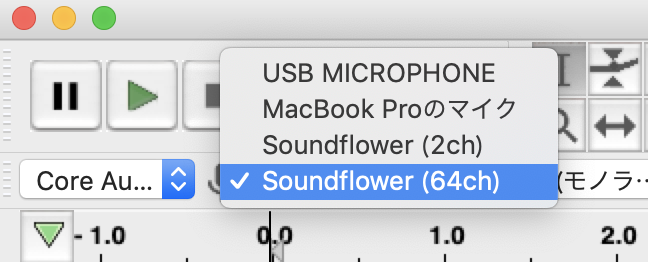
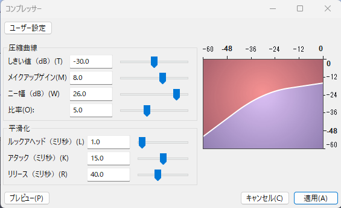

# 収録の流れを考える

単独でも複数人の収録でも収録の流れを用意して周知しておいた方が良いでしょう。喋っている時に次の状態を意識しながら喋るのは結構難しく、上の空になってしまいがちです。それよりも事前に流れを決めておき、それを見ながら喋ると、個々の話題に集中できるので、より楽しいPodcastにできるでしょう。収録の流れと言っても喋る内容を一言一句細かく用意する必要はありません。あまり用意しすぎると原稿を読み上げるナレーションのようになってしまいます。例えば次のような項目だけ用意しておくと良いでしょう。

 * オープニング
 * 自己紹介
 * メインテーマ
 * 告知
 * エンディング

オープニング、告知、エンディングなどは毎回同じことを言うと思いますので原稿を作っておくと良いと思います。自己紹介、メインテーマなどはその時の流れで収録した方がよりよいPodcastになるかと思います。

収録の流れの詳細については、3章でより詳しく触れます。ここでは気負いすぎず、なにを話すかについて箇条書きくらいを作っておこう、くらいの軽い気持ちでいても十分でしょう。

## 収録する

いよいよ収録です。

具体的な録音手順としてはまず録音するPCの電源を確認しましょう。デスクトップの場合は気にしなくて大丈夫ですが、ノートパソコンの場合は必ず確認しましょう。電源をつなぎ忘れて録音を始めてしまい、録音途中に慌てて電源に接続することになると話のテンポが台無しです。また気づかずに電源が切れて録音に失敗してしまった!という悲しい結果にもなりかねません。こういったミスは慣れてくると発生しやすいミスなので、念頭に置いておくと良いと思います。

次に録音ソフトを起動します。ここではAudacityで説明しますが、だいたいの録音ソフトで同じような手順で録音可能だと思います。

最後にマイクを接続してみましょう。Audacityのモニターを開始をクリックすることで現在の入力から拾っている音を視覚化できます。

Audacityではどの入力インターフェースから録音するか決められるので、想定した入力になっているか確認します。

もしここで使用したいマイクが表示されていない時はメニューの「録音と再生」、「再生デイバイス情報の再スキャン」で入力している機器の再確認を行います。正常に接続できていれば入力インターフェース一覧に接続したマイクが表示されるはずです。

最後にマイク側のミュートを解除しましょう。マイクによっては接続直後は自動でミュートになるため、解除しないと音声が拾えないものがあります。

正常に接続できたらテスト録音してみましょう。過去に同じ構成で録音したことが合ってもゲストが違ったり、体調の変化などで声の大小が変わることがあります。必ずテスト録音をして、マイクや座る位置、録音レベル、周囲のノイズの有無などを確認しましょう。

テスト録音が正常に終了すればあとは本番の録音です。話すことを楽しんでPodcastを録音しましょう。

