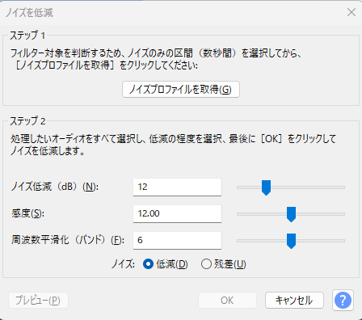
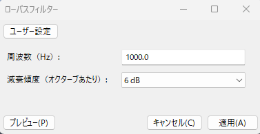
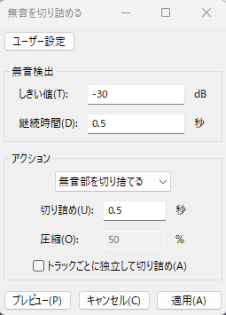
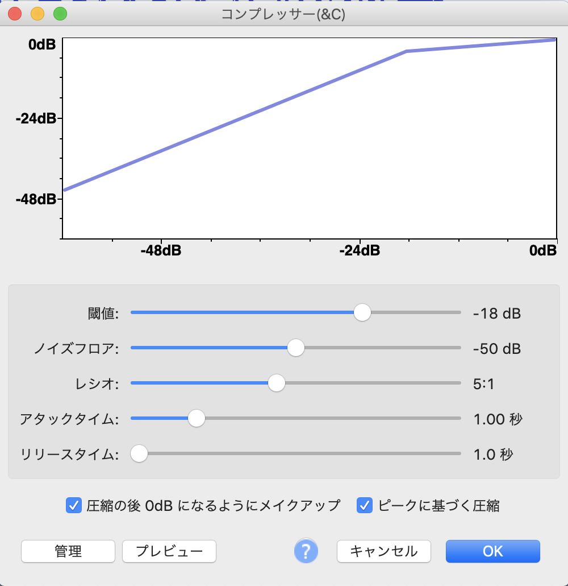
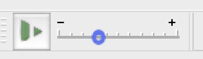
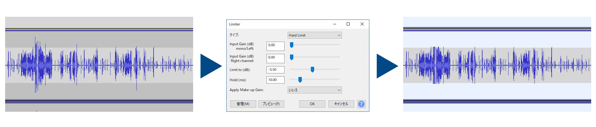
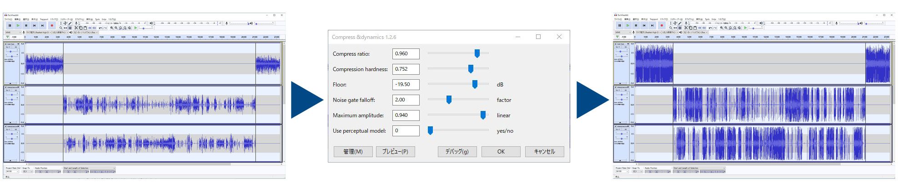
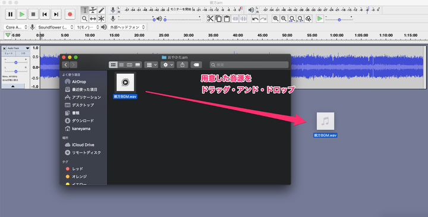
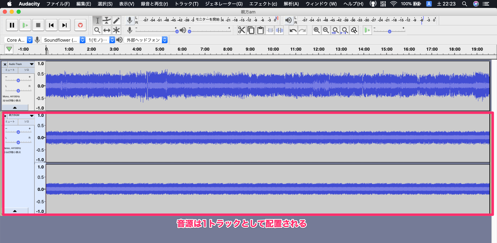

# TODO 編集 最新に書き直す
筆者がいつも行なっているAudacityでのお勧めの編集方法を記載します。これだけでかなり良い感じになるので、ぜひ一度お試しください。

## 音量を大きくする

最初に音量を大きくします。音量や音質は録音時の環境が大事ですが、編集でもある程度は調整することが可能です。この編集方法ではなるべくノイズが少ない環境で、なるべく大きい音量で録音することが大事です。
音量の調整ですが、全選択してメニューからコンプレッサーを選択します。設定はデフォルトの状態から次の項目を変更します。ちなみにデフォルトにするのは、管理 -> 出荷時プリセットから可能です。

 * 閾値：-18
 * レシオ：5:1
 * 「圧縮の後0dBになるようにゲインを調整する」をOnにする
 * 「ピークに基づく圧縮」をOnにする

## ノイズの削除

全体的に音量を大きくしたため、ノイズが目立つ状態になっています。このノイズを目立たなくします。まず、ノイズのみの音声部分を選択し、メニューからエフェクト -> ノイズの低減を表示します。そのままノイズプロファイルの選択をクリックします。今度は全て選択してメニューからエフェクト -> ノイズの低減を表示します。ノイズを低減するレベルを指定してOKをクリックします。

筆者はノイズ低減を12dB、感度は6.00、周波数平滑化を3にしています。この内容は筆者がいろいろ試した見た結果で、単純に私がもっとも好みな設定だというだけです。ちなみにノイズ低減を強くするとより強くノイズを低減できますが、ノイズ以外の音声も聞こえづらくなってしまいます。なおノイズの低減は全選択すると処理に時間がかかるので、特にノイズがひどい部分のみ選択していろいろ試して見ることをオススメします。

## 歯擦音の低減
歯擦音（しさつおん）は「さしすせそ」に対して出る音です。「〜ですー」とか「〜だしー」のようなときに出やすいです。普段の会話などではあまり気にならないのですが、コンプレッサーによる調整により全体音量が大きくなっているため、かなり耳障りになります。
まず全選択してメニューからエフェクト → Low Pass Filter（ローパスフィルター）を選択します。私はデフォルト設定のままにしていますが、好みでいろいろ変えてみてください。

## 無音の切り詰め
次に無音部分の切り詰めをします。会話部分で長い間ができてしまったり、調べ物をしたりするあいだの間を短くすることでテンポをよくします。
全選択してからメニューのエフェクト → 無音の切り詰めを選択します。私は0.5秒が好みですが、お好みで設定を変えてください。
なお、無音の切り詰めはトラックがひとつのときにだけやるようにしましょう。オンライン収録などで複数人のファイルを一つにする前にそれぞれのトラックで無音を切り詰めると音ズレが発生してしまいます。そのため、音源が複数ある場合は手作業で間隔の調整をしたほうが結果的に早く編集出来ると思います。

## 音量の調整
最後は最初に大きくした音量を良い感じに調整します。これが配信する際の音量になるので、最初の手順で大きくした音量でちょうどよければこの手順は必要ありません。
まずは全選択して、そのあとにメニューからエフェクト → コンプレッサーを表示します。次にデフォルトから次の項目のみ変更します。

 * 閾値は-18
 * レシオは2:1
 * 「圧縮の後0dBになるようにゲインを調整する」をOffにする
 * 「ピークに基づく圧縮」をOffにする

最初の手順とはレシオとチェックボックスが異なりますのでご注意を。レシオとチェックボックスを変更することで、Audacity上の表記だとだいたいMaxが-9dBくらいになります。

Audacityにキーボードショートカット追加

よく使う機能はキーボードショートカットに設定しておくと編集が捗ります。MacではメニューのAudacity、環境設定からキーボードを選択します。Windowsではメニューの編集、設定、キーボードです。右上の検索窓から機能名を検索してショートカットを割り当てていきます。筆者は次の機能を登録しています。

 * ノイズの低減（Control + S）
 * 特殊な削除・切り取り・無音化（Control + E）
 * 増幅（Control + R）
 * 削除（Control + F）

括弧内は筆者が実際に設定しているショートカットになります。これらのショートカットに加えて再生と停止をスペースキーで行うことで編集効率がよくなります。ぜひお試しください。

## 細かい編集を行う

音声ファイルを最初から聞いて細かい編集を行います。筆者は1.5倍速で聞き直して確認しています。再生速度はAudacityの右上にある再生ボタンとバーで調整できます。

編集する観点としては次の点を確認します。

 * 不自然な間があいてないか
 * 間が短くないか
 * カットすべき箇所はないか
 * ノイズの削除

事前の編集で間を詰めていますが、一定以上の音が出ている箇所は詰められません。例えば調べ物などをしていてキーボードの操作音などが入っていると不自然な間になってしまいます。これらは実際に聞いてみないとわからない間になります。また0.5秒では短すぎる間というものもあります。ちょっと考える間だったり、開始と終了はもう少し間があったほうが良いでしょう。筆者は0.5秒の間と1秒の間を使い分けています。通常の会話の間は0.5秒にして、開始と終了や考えたり悩んでいるときは1秒にしています。

聞いていて不要な部分はカットしていきます。例えば調べ物をしていて待っている時間や、なにか収録に関係ないことをしている時間などです。筆者はよくノートPCに電源をつなぐのを忘れてしまい、収録中にガソゴソと電源をつなぐ事があります。そういった部分は不要なのでカットします。また、たまに会話でテンションが上がってしまい、公開するには不適切な話題や不要な会話をしてしまうときがあります。そういったものが公開されないようにカットしていきましょう。

次にノイズの削除を行います。こちらも事前の編集で削除していますが、異なる種類のノイズはそれごとに対応が必要となります。例えば扉を開けた音、外の車の音、航空機の音、キーボードのタイプ音などノイズはいくつか考えられます。それごとにノイズが目立たないようにしていきましょう。会話とかぶっていないノイズはそのまま削除すれば大丈夫です。会話とかぶっている場合はそのノイズが単独で出現している部分を選択してノイズの低減機能で目立たなくしていきましょう。編集で行えるノイズの対応には限界があります。なるべく収録時にノイズが乗らないようにしたいですね。

プラグイン

Audacityには、インストール時に同梱されている標準のエフェクト以外にも、後から導入できるフィルター（プラグイン）が多く存在します。次のようなプラグインが便利です。

 * 「Chris’s Dynamic Compressor plugin for Audacityhttps://theaudacitytopodcast.com/chriss-dynamic-compressor-plugin-for-audacity/」

このプラグイン（メニューでは Compress Dynamics 1.xx... と表示されます）を利用することで、標準フィルターのコンプレッサーよりも強く圧縮をかけることができます。

また、初期インストール時に同梱されている「Limiter（リミッター）」フィルター（最大音量を無理やり削ることができるフィルター）と組み合わせることで、より音量の振れ幅が少ない、聴きやすい音源を作ることができます。

たとえば、通常の声はボソボソと音量が低い、でも、ところどころに爆笑のシーンがあって音量差が激しい、というような収録音源を想定してみましょう。この場合、まず「Limiter」フィルターで音量が大きな部分をクリップ、次に「Chris’s Dynamic Compressor plugin」を適用することで、強い圧縮効果が期待できます。

ただし、この場合もノイズが大きく影響するため、設定によっては「要らないノイズが増幅されてしまった」もしくは逆に「小声で喋っている大事な部分が聞こえなくなってしまった」といった結果になることがあります。まずはノイズが多そうな部分や、話者の声が小さくなってしまっている部分で局所的に適用結果を確認し、そのあとで全体に適用することをお勧めします。

BGMを付ける

Podcastの中には、BGMをつけているものがあります。

BGMをつける理由としては

 * Podcastの雰囲気を演出するため
 * 小さな物音や雑音を意識させないため

などがあります。

編集でノイズを削減するものの、完全に消すことはほぼ不可能です。そこにBGMを載せることで、ベースレベルを上げ、ノイズを目立たなくすることができます。

BGMを探すのに便利なサイトとして、「魔王魂」というサイトがあります。

https://maoudamashii.jokersounds.com/

魔王魂で配布されている音源には、ループ可能な音源かどうかが記載されているものがあります。ループ可能な音源を選ぶことで長時間BGMを流す場合でも違和感なく流し続ける事ができます。

ループ可能な音源をBGMで利用する長さに加工します。このとき、audacityを用いてループさせることができますが、予め長めのループ音源を用意して保存しておくと便利です。ループ音源の加工が終わったら、既存の音声に重ねて合成します。

BGMの音量は、自身の耳で調整をしましょう。気にするべきところとしては、収録を通して声が一番小さな部分が消えていないかというところです。

なお、BGMについては、必須なものではありません。リスナーによっても必要派の人と不要派の人がいるので、周りの反応もみながらつけてみると良いでしょう。

