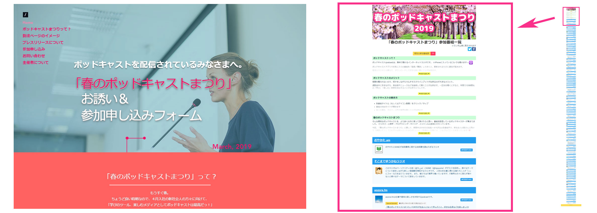
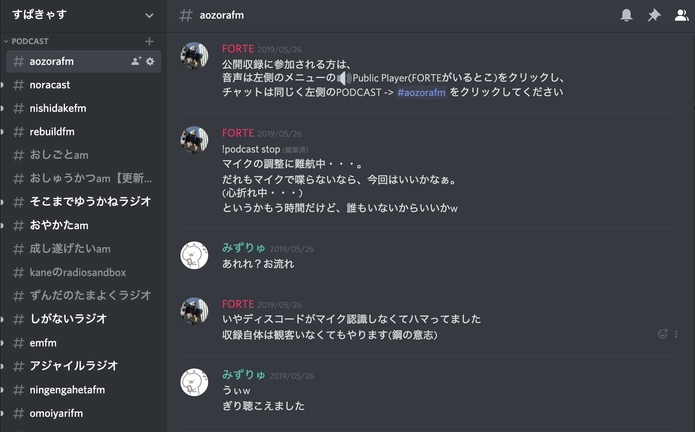
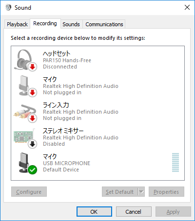
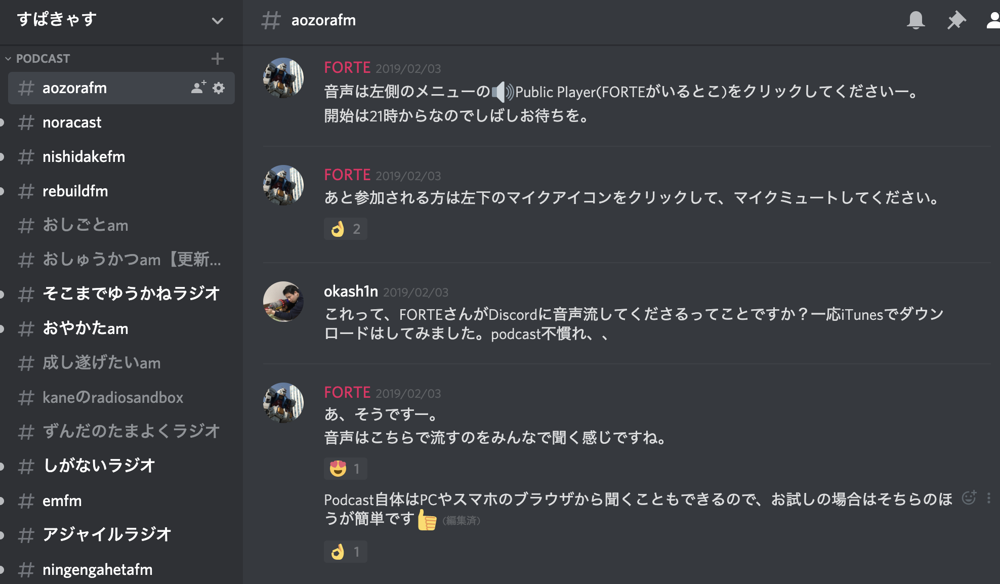

# Podcastを続けよう
Podcastを配信する理由、モチベーションは人それぞれです。

楽しいから、新しい情報や人に触れられる、伝えたい情報・話題がある。本当に多種多様です。それぞれのパーソナリティのモチベーションは、Appendix.Bにインタビュー形式でありますし、Appendix.Aでは「なぜPodcastを聴くのか」についてのインタビューがあります。こちらも「聞く理由」そして、それの対面として「配信するモチベーション」になるのではないでしょうか。

本章では、Podcastを継続するという点にフォーカスして、パーソナリティの内的モチベーション以外に、Podcastを配信し継続するモチベーションとなりうる、Podcastを通じたイベントなどについて触れます。

また、後半は、継続のためのテクニックについて述べます。Podcastは始める以上に続けることが大変なのはその通りです。この世の中には更新されなくなったたくさんのPodcastがあります。Podcastを継続する大変さ、継続する楽しさ、継続する工夫を見ていきましょう。

## Podcastの楽しさ

Podcastを聴くこと、配信すること自体も楽しいのですが、Podcastに関連したイベント、楽しみかたもあります。本節では、そういったイベントなどについて取り上げます。

### オフラインイベント-しがないラジオMeetupを例に

Podcastをきっかけや題材にして、イベントを開催するということもできます。
いくつか事例を紹介します。

#### しがないラジオMeetupについて
『しがないラジオ』では、しがないラジオmeetupというオフ会を半年に一回開催しています。
都内の100人規模の会場を借りて、connpassで募集をかけて、LTや公開収録や懇親会をする会です。
2019年6月に開催した時は、約70名もの人が参加してくれました。

最初にmeetupを開催したきっかけは、リスナーの1人から「オフ会やってくださいよ」といわれたことでした。
あるPodcast番組をたくさん聴いていると、その番組の内容について誰かと話したくなります。
Twitterのハッシュタグ上でやりとりされることはありますが、やはりリアルで会って話した方が楽しいと思います。
「リスナーがしがないラジオについての話題で交流できるオフラインの場を提供する」ということを目的に、meetupを始めました。

#### 開催してみてよかったこと
実際に開催してみてよかったことは、次の3つありました。

 * 参加したリスナーからPodcastへのロイヤルティが上がる
 * リスナーのリアルな盛り上がりが可視化されて、パーソナリティのモチベーションが上がる
 * Twitterでイベントが拡散されて、興味をもつ人が増える

イベントに参加したリスナーたちは、当初の目的どおり懇親会でPodcastの内容についてのオフラインの会話を楽しむことができます。
特にしがないラジオは、エンジニアやSIer関係者などリスナーの属性に偏りがあるので、より盛り上がりに拍車がかかる気がします。
meetupの後には、参加したリスナーが、Podcastの過去回を聴いてくれたり、TwitterのハッシュタグでTweetしてくれるようになったり、ゲスト収録への参加に手をあげたりする現象も観測されました。
しがないラジオmeetupの熱量を肌で感じることで、「しがないラジオいいなあ、もっと積極的に関わろう」と感じてくれた人が増えたということだと思います。

#### 配信者のモチベーションにも
こうしたリスナーの盛り上がりをリアルな場で見ることで、パーソナリティとしてもPodcastを続けるモチベーションにつながります。
特にPodcastはファンが可視化されにくいメディアの1つです。
配信の構成によっては、合計再生数すら正確に取得できないケースがあります。
オフラインのイベントを開催してリスナーと直接交流することで、パーソナリティとしても「ちゃんと聴いて価値を感じてくれている人がいるんだ、もっと続けよう」というモチベーションになります。

#### 宣伝にも
イベント自体にも「#しがないラジオmeetup」というハッシュタグを用意したところ、それを見たリスナーのフォロワーから関心が集まるということもありました。
Podcastはテレビなどのリアルタイムなメディアと違っていつでも聴くことができるので、Twitterなどのオンラインコミュニティでも単位時間当たりの発言数が増えるタイミングがあまりありません。
イベントによって同期的に参加者が同じコンテンツを楽しむことで、Twitterにもリアルな盛り上がりが漏れ出てきて、イベントに参加していない人にも「なんだこのイベントは」と関心を抱くきっかけを与えることができました。
そこから調べてPodcastを聴き始めてくれた人も、きっといたと思います。

#### イベントは大変だけど
オフラインイベントを主催するというのは、特に規模が大きくなると結構大変でコストもかかります。
会場探し、飲食物の発注と受取、参加者の管理や受付など、思ったよりもやることは多いです。
それでも、自分たちがやっているPodcastについて懇親会でリスナーたちがワイワイ話しているのを見るのは、とても楽しく幸せな瞬間です。
Podcastがある程度続いたら、一度リスナーを集めたオフ会を企画できないかと考えてみるとよいと思います。

### 春のポッドキャストまつり

あるとき「Podcastユーザーを増やすために、何かできることはないか…？」と考えていました。

当時、季節は2月で受験シーズン真っ盛り。通勤電車には、某チョコレートのラッピング広告が展開されていて、受験生への応援メッセージが綴られています。また、もうしばらくすると、春に新しく社会人になる人が増える時期でもありました。

そこで、「新社会人の方々への応援メッセージを、さまざまなPodcast 番組が一斉に伝えたら面白いかも？」と思いつきました。さらに「情報収集や学習のツールとして、実はポッドキャストがオススメです！」ということが伝われば、ポッドキャストの利用者が多少は増えるかも…。

さっそく「春のポッドキャストまつり」と名づけ、イベントの説明ページを制作し始めました。並行して、交流のあった配信者の方々にもお声がけし、イベントに参加して頂けるポッドキャスターさんを少しずつ増やしていきます。

 * 春のポッドキャストまつり2019のご案内
     * https://sfreeengineer.wixsite.com/podcastfes2019spring

申し込みフォームをわざわざ Vue.js + Firebase で作ったり、積極的に協力頂いた aozora.fm のFORTEさんと手分けして、交流のない配信者の方々にもTwitterのDM等でお声がけしたりと、準備はかなり大変ではありました。

が、その甲斐あって、70を超える番組に参加いただくことに（驚）。

 * 春のポッドキャストまつり2019 参加番組一覧
    * https://podcast-festival.firebaseapp.com/

ところが、こうなってくると、イベントを立ち上げた身としてはプレッシャーがかかってきます。当初は「参加番組が10ぐらい集まってくれれば御の字。多少盛り上がれば嬉しいなぁ…。」 ぐらいに考えていたんですが、これだけの番組が集まったとなれば、それなりにプロモーションを行わなくては…と、欲が出てきます。 色々と調べ、PR TIMESさんでプレスリリースを出すことにしました。

結果としては、プロモーション費用として3万円かけた割にはバズることもなく、イマイチだったかなぁという気がしています。（一応、エキサイトニュースやニコニコニュースなどの17媒体に掲載された、とのレポートはありましたが、おそらく機械的に掲載されるメディアだと思われます。）

とはいえ、このイベントでの一番の収穫は、農業やバイクなど、今まで知らなかったさまざまなジャンルの配信者さんと知り合えたという点でしょうか。イベントの企画や運営は、やはり主催者側はそれなりに大変だなぁ、というのが実感ですが、みんなが乗っかれる「祭りの場」を創ることができた、という点では良かったのかな？と思っています。参加して頂いた配信者の皆さんが、楽しんでくれていればよいのですが…。

### 公開収録
aozora.fmでは定期的にオンラインでの公開収録を「すぱきゃす」で行っています。これはDiscordのボイスチャットを収録することで手元のPCで録音しつつ、参加者が音声を聞ける環境を構築しています。また参加者は音声だけでなく、チャットで参加できるので参加のハードルを下げつつ収録に参加することができます。この音声やチャットでリスナーが参加することで、これまで聴くだけだった一方通行のPodcastから、自分のリアクションがリアルタイムにダイレクトに伝わるメディアになります。

公開録音の参加者からはこの動的なやり取りが非常に楽しいと感想を頂いています。

#### 動画を付けられる
また、収録するツールをZoomなど画面配信が可能なものにすることで動画の配信も可能になります。動画配信とセットにすることでより空気感や表情が伝わりやすくなります。あくまでPodcastとして配信するための公開収録なので、リアルタイムでは不明瞭だった部分も後日Podcastで聴き直すことができます。関連リンクなどでさらに補足することができます。

こちらも動画配信サイトにチャットやいいねボタンなどの視聴者がリアクションが取れる仕組みがあればリアルタイムでやり取りをすることができます。

#### 双方向のメディアへ
Podcastの公開収録はこれまで配信と感想というメールのようにタイムラグがあるやり取りから、チャットのようにリアルタイムにやり取りができるメディアにすることができます。改めて感想やお便りを送るよりもリアルタイムにチャットするほうが反応しやすいと思いますので、ぜひ公開収録をやってみましょう。

#### 公開収録のやり方
公開収録の収録環境は本書の「Mac でパーソナリティ側でのみオンライン収録環境を作る」などを参考にしてください。普段からDiscordで収録をしているPodcasterの方は環境が変わらずに収録できると思います。録音をAudacityで行う場合はAudacityのマイク入力をSoundflower(64ch)にします。

もし普段Discordを使用していない場合はぜひ「すぱきゃす」の利用をご検討ください。「すぱきゃす」での公開収録は誰でも可能ですし、どんなイメージか知りたい場合はaozora.fmの公開収録にぜひ遊びに来てください。

aozora.fm オンライン公開収録に参加しました

#### リスナー参加型のPodcast
Podcastが聴いていると楽しくなってきて、出演してみたい気持ちがだんだん出てきます。でも、なんだか大変そうだし、やっぱり恥ずかしい。そう思っていた時に、チャットで参加できるPodcastのオンライン公開収録が開催されることをTwitterを通して知り、参加してみることにしました。

#### ここが面白い

aozora.fmの初の公開収録に参加しました。Discodeというチャットアプリを使います。（詳しくは「すぱきゃす」の紹介にて）

この日は「Podcast」をテーマにおすすめのPodcastなどについて語り合いました。パーソナリティのFORTEさんや一緒に参加しているリスナーさんの興味をリアルタイムに知ることができます。いろいろなPodcastがあるんだなと思い、新しい発見でした。ジャンルの幅が広がります。

チャットで質問や感想などコメントを送るとFORTEさんがそれを拾って読み上げていきます。インタラクティブに番組が構成されていくのがとても面白いです。自分が送ったコメントが読まれるとちょっと恥ずかしいけど嬉しいです。

#### いよいよ配信

収録から数日後にPodcastが公開されます。エピソードWebページには私のTwitterアイコンを掲載してもらいました。これで私も憧れのPodcastに初出演ですね。

#### 最後に

オンライン公開収録に参加してPodcastの楽しみ方が増えました。他のPodcastでもこのようなイベントが増えればいいなと思いました。マイクで話す必要はありません。チャットで気軽に参加してみませんか？

### 公開聴取回
aozora.fmでは公開聴取回というイベントを何度か行っています。この公開聴取回はすでに配信されているPodcastを一箇所に集まって決まった時間に一斉に聴くイベントです。一箇所に集まって一斉に聴くことで、その場で感想のやり取りができます。

普段Podcastをながら聞きしていたり、車や家事のお供で聞いていると感想を発信しにくいことと思います。公開聴取回のようなイベントに参加することで感想をアウトプットできたり、他人の感想を聴くことで新たな気づきがあったりして、Podcastの新たな楽しさが実感できると思います。

またPodcasterやゲストの方が参加することで収録時の裏話や補足、訂正などができるのも良い点だと思います。

#### 元のアイディア
もともとはオンラインゲームの宣伝ラジオをそのオンラインゲームの中で、仲間とともに聴取する文化を参考にはじめました。そのオンラインゲームでも土曜日の21時にとある街の特定の場所に集まって、ワイワイ感想を言い合いながら一緒に聞きます。その雰囲気が非常に良いと思ったので何度か実施してみました。

またaozora.fmの公開聴取回はインフラ勉強会というオンライン勉強会でも実施したことがあります。この時みんなで聞いたエピソードは働き方に関するエピソードだったので、非常によい気付きや感想のやり取り、自分の経験などを共有してもらうことができました。特にPodcastにこういった聞き方ができること、感想の共有の良い点、アウトプットのしやすさを伝えられたのは非常に有意義な場にできたと思います。普段は聴くだけのリスナーさんもアウトプットしやすくなる公開聴取回はお勧めのイベントだと思います。

#### 公開聴取回のやり方
公開聴取回のやり方ですが、オンラインでチャット可能な場所があればどこでも可能です。その場所でPodcastを参加者で同時に再生してチャットで感想のやり取りを行います。オンラインでチャット可能な場所はDiscordがやりやすいと思うので、「すぱきゃす」をお勧めします。Podcastを同時に再生するのは参加者がそれぞれ再生する方式でも可能です。ですが、誰か一人が再生した音声をDiscord上に流してみんなで聴く方式がお勧めです。これなら確実に同期して聴くことができますし、途中から参加した人も再生場所を合わせる手間がありません。

#### Discordでのやり方
自分のPCで再生している音声をDiscord上に再生する方法を説明します。

まずWindowsの場合ですがタスクバーのスピーカーアイコンを右クリックして「サウンド」をクリックします。

次に「録音タブ」のステレオミキサーを有効にすると自分のPCで流れている音がマイク入力されるようになります。

次にMacの場合ですが、本書の「Macでパーソナリティ側でのみオンライン収録環境を作る」を参考に設定してください。なお、LadioCastを使用する際は**必ずマイクやヘッドフォンを接続した後にLadioCastを再起動**してください。この設定のあとDiscordの音声設定で入力デバイスをSoundflower(64ch)に、出力デバイスをSoundflower(2ch)にするとスピーカーで再生している音声が再生されます。

公開聴取回は普段が異なる聴取体験をリスナーに提供でき、新しいPodcastの楽しさを実感できると思うのでお勧めのイベントです。

### 飲み会収録
収録の一つのメソッドとして、飲み会を収録する、という方法があります。過去、打ち上げの二次会やラボでの年越しイベントなどを収録して、編集してもらって公開したことがあります。

#### メリット
メリットとしては、気張らずに収録して公開実績を増やすことができること、ただの飲み会であっても案外楽しいし聞いていて面白いトピックが出てくることなどが挙げられます。これまで散々ネタだしが難しいといったトピックがありましたが、飲み会なら話すネタいくつもありますよね。

ただし、広く一般向け、というより、ある程度内輪（少なくとも出演者の知り合い向け）といった雰囲気は否めません。ですが、たまにはこういう空気も良いと思いますよ？

https://fortegp05.github.io/aozorafm/episode/sp2

https://fortegp05.github.io/aozorafm/episode/sp1_1

#### デメリット
デメリットは、時間が読めないこと、トピックが読めないこと、Shownoteが作りづらいこと、編集が大変なこと、グダグダ感が出てしまうなどが挙げられます。また大前提として、「収録、公開すること」を参加者全員に許可を取ってから収録を始めましょう。

収録の流れとして、今回の飲み会の背景の説明、参加者の自己紹介、本編、今日の感想・告知など、Closing。などとすると、簡単ですが案外Podcastの形になります。

#### 実際の様子と収録の流れ
前出のaozora.fmの特別編では、sp1がラボでの年越しイベントを6時間ほどに渡って収録したもの、SP2は技術書典後の本の打ち上げの二次会を収録したものです。年越しイベントでは、前半にエンジニアの生き方といったかなりエモい話がたくさん話され、これがそのまま虚空に消えていくのはもったいない、と感じた事が収録するきっかけになりました。バックグラウンドも経験も異なる人が集まり、話をすることで、Podcastのネタとしては十分です。

収録は、中央にマイクを置いて、車座になり、フリーで喋ります。ときどき必要に応じて交通整理ができるとなお良いですね。「XXさんどう？」とか、「前に一家言ある・似たような話あるっていってなかったっけ？」と話振ってみてもいいかも知れませんね（無理強いはいけません）。

#### 編集のことも考えておく
また、失言や放送をしたくない内容があった場合は、編集点を作っておくと便利です。ここは編集します、と言っておいて、一瞬間を開けます。

例：この件、実はXXなんですよーオフレコでお願いしますね。　はい、編集点入れます。（1.2.3。）　そういえば～　など。

飲み会ならではの自由さが良いほうに転ぶ場合があります。あるいは収録しているため毒が吐けなくなるなどの制約は多少出てきますが、それは別の飲み会でやりましょう。

#### 様々な効果
大人数で飲みながらやるため、編集は大変かも知れません。ノイズや物音、発言のお見合いなどはあるかもしれません。ですがあまりこだわりすぎることなく、音量調整と簡単なノイズ除去くらいでも十分かも知れません。

参加者にとっては、Podcastに関するハードルを大きく下げる効果があると思います。ゲストとしてたくさん喋らなきゃいけない、あるいはパーソナリティとしてたくさん喋らなきゃいけない、場やストーリーをコントロールしなければいけない、など、自分でやるときならではのプレッシャーはあるかと思います。飲み会収録であればそのあたりはかなりハードルを下げられるのではないでしょうか。

何なら聞いているだけでも楽しいし、少し喋れる所があれば少ししゃべってみる。それだけでも十分なPodcastデビューです。

また、自分が参加したその飲み会収録を聞いていて、「お、いまの振りかた、パーソナリティっぽい」と思ったことが何回かあります。ちょっとしたことですが、数回Podcastをやっての自分の成長を少し感じられた瞬間でした。

飲み会は通常二人以上、場合によっては5人10人の大人数で開催になるでしょう。飲み会収録の結果、自分以外の全員がゲストになりますから、改めて（本来・通常の）ゲストとして再度出演してもらうといったことにも繋げられるかも知れません。

繰り返しになりますが、「収録、公開すること」を参加者全員に許可を取ってから収録を始めましょう。楽しい収録ライフを！

収録中に柿の種を食べてはいけない

柿の種、おいしいですよね！

飲み会収録はそれはそれは楽しいものですが、おつまみには注意しましょう。スナック菓子などの音が出るものを食べるとそれがノイズになり、編集に大変苦労します。

ApplendixCに本書完成を記念したPodcast特別編の案内がありますが、完成記念ということで飲みながらの収録となりました。収録場所はラボなのですが、おつまみに近隣スーパーで売っていた柿の種が含まれていたのです。結果、ノイズ出まくり、という結果になります。

KANEさんが頑張って編集してくれましたので、配信版はかなりクリアになっていますが、比較として録って出しのも載せています。ぜひ比較してみてください。

数あるおつまみの中で、なぜ柿の種を選んだのか…ほかにもいいおつまみはあるでしょう。音が出づらいおつまみを選びましょう。

重ねてのご連絡です。

Podcast収録中に柿の種を食べてはいけません！

### TODO 同人誌・Zinn

### TODO rooom

