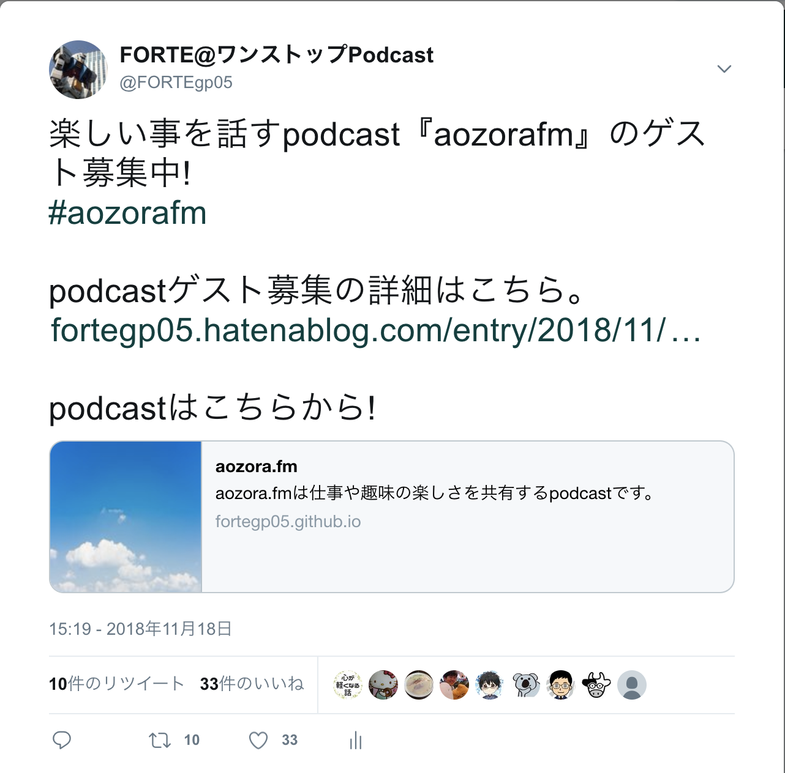
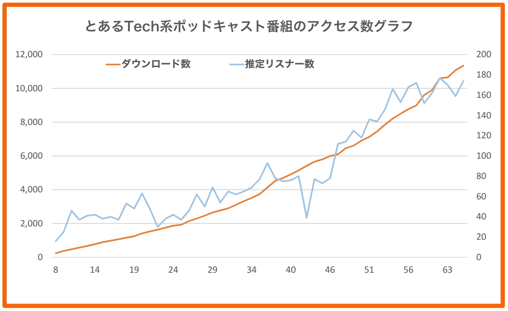
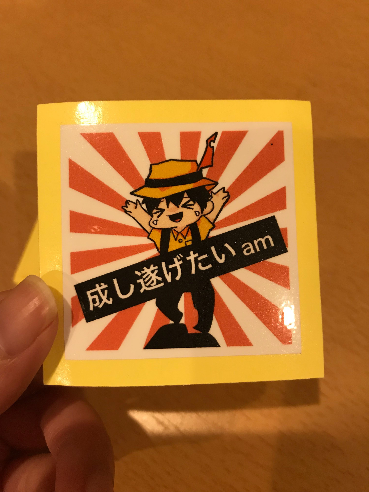

# 継続の障壁と対策

なんといっても、Podcastの最大の障壁は継続することです。始めることは簡単でも、リスナーがいるのかいるのか実感できずフィードバックがない、ネタ切れする、ゲストが見つからない、など、さまざまな障壁があります。ここでは、これらの問題と対策についてトピックス的に取り上げます。

## ゲスト問題

Podcastがゲストを呼んでしゃべるタイプの場合、誰をゲストに呼ぶか、そのゲストをどう呼ぶか?という問題が発生します。最近はPodcastが流行っているとはいえ、ゲストに出たがる人は少ないでしょう。また自分の知り合いに出たいと言ってくれる人がいるかどうか、という問題もあります。Podcastそのものよりもゲストを呼ぶ準備、苦労に負けてしまって更新するのが億劫になってしまうことがあると思います。ゲスト問題について対策や事例を考えてみたいと思います。

### 知り合いを増やす

Podcastのゲストに出たい人が少ないのであれば、自分の知り合いを増やして可能性を高めていくのが良いでしょう。具体的にはTwitterのフォロワーを増やす、勉強会などで知り合いを作る、コミュニティに参加する等があると思います。ですが、ゲストに出てくれるような知り合いは一朝一夕でできるものではありません。誰だって今日初めて会ったくらいの大して知らない人からPodcastに出てください!と言われても、気後れするでしょう。そのため、知り合いを作る際には自分のことを知ってもらう、アピールすることが大事だと思います。仮に勉強会で初めて会った人でもTwitterで見たこと、話したことがある人や、コミュニティのSlackなどで知っている人であれば打ち解けやすいものです。

### Podcastのアピール

では、アピールするにはどうしたらいいのでしょうか?それにはアウトプットすることが効果的だと思います。アウトプットする対象は何でも構いません。ブログ、登壇、Twitter、動画、サービスの作成、技術書の執筆、自分ができそうなことをやればよいのです。そしてそのアウトプットに自分のPodcastの宣伝をそれとなく入れておきましょう。自己紹介をする際にやっていることとして紹介したり、宣伝などをする際にゲスト募集をしたりすると効果的です。なお、アピールや宣伝が主目的にならないようにしましょう。あくまで「ついで」で宣伝させてもらいましょう。

### Podcastにゲスト出演させてもらう

ですが、アピールするのに最も効果的なのはPodcastでしょう。Podcastを続けることでPodcasterという印象が付き、ゲストにも出てもらいやすくなります。しかし、ゲストがいないから続けられないのに、Podcastを続けるとゲストが来るという話では本末転倒です。

可能な限り自分のPodcastを継続的に配信することが大事ですが、どうしてもゲストがいないと難しいようであれば、他の人のPodcastにゲスト出演しましょう。

#### お互いにゲストを探しているかも
自分がゲスト出演する人を探しているということは他の人も同じようにゲストを探している可能性があります。普段から聞いているPodcastでゲスト募集をしていたら、勇気を出して声をかけてみましょう。そしてゲスト出演できたら、ゲスト募集の告知をさせてもらいます。そして何より、そのPodcastのパーソナリティに自分のPodcastへのゲスト出演を持ちかけてみましょう。PodcasterはPodcastで話すことが好きだから続けている事が多いので、喜んで出演してくれることでしょう。

Podcastで繋がった縁であれば、ゲスト出演にも興味を持ってもらいやすいと思います。

### aozora.fmの場合
執筆時点でaozora.fmには40名のゲスト希望を頂いております。これはいきなり40名の方に希望を頂いたのではなく、徐々に増えていってこの数値になりました。

まずPodcastを始める際にTwitterでゲスト募集をかけたところ、多数のゲスト出演の希望をいただけました。これは前述したTwitter上の知り合いが増えていた効果もあったと思いますが、2018年の11月くらいは筆者の周囲でPodcastが流行っていた時期だったということもあると思います。さらにこのとき他のPodcastにも出演させていただき、Podcastを始めたことをアピールすることができたと思います。

#### 平行して他のアウトプットも
さらにPodcastの配信を継続すること、平行して様々なアウトプットをしていたことも効果があったと思います。Podcastの配信は平均すると月に3、4エピソードずつ継続して配信できています。これは間があいても最大半月程度であり、継続的に配信してくれて嬉しいという感想もいただけています。

Podcastの配信を継続することで定期的に感想もいただけて、ゲストの方にも拡散していただき、Podcastに対して良いループが回っていると思います。

#### 具体的に行ったアウトプット
Podcastと平行して登壇、ブログ、技術書の執筆、勉強会への参加を行っていました。それぞれのアウトプットにはPodcastの宣伝を入れたり、勉強会で自己紹介をする際に実はPodcastをやっていて〜ということをお伝えしてたりしていました。このときTwitterにピンどめしていたTweetがPodcastのゲスト募集だったのも効果があったと思います。名刺にTwitterのQRコードを印刷していたこともあり、知り合った人がTwitterを通してaozora.fmのことを知っていただいたり、ゲスト参加に興味を持っていただけたのだと思います。

#### 参加しやすいテーマ
最後にPodcastのテーマが参加しやすいこと、それが上手く拡散できたことも大きく影響していたと思います。aozora.fmは楽しいことを喋るPodcastです。楽しければ何でも良いので、aozora.fmで今までに配信してきたテーマの一部は次の通りです。

 * 仕事（ITエンジニア）
 * ビデオゲーム（レトロからモダンまで）
 * JavaScript（Riot.js）
 * 読書
 * 歴史（三国志、日本の戦国時代）
 * アニメ
 * 音楽ライブ
 * アウトプット（登壇、ブログなど）
 * 働き方
 * 釣り
 * 合唱
 * 野球
 * ラノベ
 * ボドゲ

これでも一部なのですが、これだけ多岐にわたる話題について話しています。そしてゲストの方からの感想として、パーソナリティである筆者が多趣味でありどのテーマでも興味があるので話しやすいと言ってもらえます。こういった参加しやすいテーマ、話しやすい環境というのが拡散できたことが多くの方にゲスト出演希望をいただけたのかなと思います。

自分の声が嫌いじゃなくなる @みずりゅ

みなさん、自分の声が好きですか？それとも嫌いですか？私は後者でした。
学生時代に「自分の発音を録音して聴いてみる」な宿題をした際に、普段自分が聴いている声と違うことに違和感を持ったからかもしれません。
これが影響したのか、なるべく「話す」という行為は避けてきました。

しかし、とある事がきっかけでPodcastにゲスト出演してみたい、という想いに駆られて出演しました。
そして、その収録内容が公開されたのです。戦々恐々としながら聴きました。
やはり違和感はありました。しかし、不思議と昔ほどの拒否反応は出ませんでした。
多分、自分が好きなことを話していたからかもしれません。

一通り聴き終わった後、もう一回聴き直しました。自分の話し方の癖とかを直すならどう言う所かな、とか気になったからです。
ついでに言うと、自分が楽しいと思うことを話しているのです。その話を聴いて一番楽しいと思えるのはやはり自分ではないでしょうか。
そんなことも関係し、他に聴くPodcastがない時は自分のゲスト回を聴きなおしたりしていました。

するとどうでしょう。今は自分の声は「嫌いじゃない」になりました。聴き慣れた、と言うのが関係しているかもしれません。
もし、自分の声が「嫌いじゃない」にしたいと思っている方がいるならば、Podcastにゲスト出演してみると言うのも一つの方法かもしれません。

## Podcastが続かなくなりそうなとき　－継続は力なり。だけど自分のペースで・・・

Podcastにおいても継続は力なりだと思います。

実際に、定期的に配信をされているPodcastはリスナーが定着しやすいものです。

媒体は変わりますが、YouTubeで活躍をしているクリエイターの方の中には一日一本は必ず配信をしている方もいるほどです。

しかし、本業の傍らでPodcastを収録している人も多いでしょう。

定期的に投稿するといったことが難しい時期もあるでしょう。

とはいえ、定期更新がされなければそのPodcastが終わりなのかというとそんなことはありません。

おやかたamも更新を定期的にできなくなったPodcastの一つでした。

当初は、技術書典5の本を紹介をするといったコンセプトで始めたおやかたamですが、パーソナリティの都合が合わず、なかなか収録ができない状態が続いていました。

結局、再開したのは技術書典6の直前となりました（約半年ほど更新が滞っていました）

ただ、不定期更新ではあるもののおやかたamは続けています。本誌のために収録した特別編もおやかたamが続いていたからこそ配信ができています。

気の向いた時やパーソナリティの都合が良い時に収録をして、配信をする。

そんなペースでもPodcastは続けて良いものだと思います。

例えば、技術書典のようなイベントが発生した時に「ちょっとポッドキャストでも録ってみるか」思えるくらいのペースでも構わないと思います。

自分のペースで収録をしたい時に収録をして配信をするそういった続け方もあると思います。

## ニュースを探す難しさ

「自分で話すネタを考えるのは大変そうだし、きっと続かないだろうなぁ。ニュースの紹介ならネタ切れになることはないし、自分にも続けられるんじゃ！？」そう思って始めたニュース系のポッドキャストも、実は意外に手間がかかったりします。

「何でもいいや」と割り切れればよいのですが、「はてブのホッテントリに入ってる記事は、さすがにみんな知ってるだろうし…」とか「ちょっと変わった切り口のニュースを…」なんて考え出すと、ニュースひとつ選ぶだけでも、あれやこれやと考えてしまいます。

また「さぁ、今からポッドキャストの収録だ！」と思い立ってから記事を探し始めると、これだ！という記事に巡り合うまでに随分と時間がかかってしまったりもします。

こういった、予想外に時間がかかってしまう現象を避けるには、やはり普段の細切れ時間を有効利用し、いかに「おっ！？」と思う記事をストックしておけるかが大切です。

最近は、スマホのニュース系アプリが興味のありそうな記事をサジェストしてくれる機会も増えました。ですが、受動的に情報収集するよりは、あえて能動的に「大量の情報に目を通し、その中から自分の気になったものをマーキングする」という習慣を身に着けることをお勧めします。

具体的な手法としては、Feedly等のRSSリーダーで興味のあるフィードを大量に登録しておきます。そして、PCの起動待ちや通勤時に電車を待っている時など、あらゆる「スキマ時間」にそれらのチェックを行い、気になったものだけに「Read Later（あとで読む）」等のマークを付けるようにします。（ただし、大量に流れてくる情報をすべてチェックしようとすると負担が大きくなり続きません。特に既読マークを付け出すと、つい既読コンプリートしたくなってしまうのでお勧めしません。スキマ時間にチェックできなかった分はあっさり諦める、というつもりでいる方が長続きします。）

こうした習慣を身に付けることで、収録しようと思った時には「厳選された候補」が手元にある状態で始められるので、番組制作が効率よく進められます。

## ニュースを伝える難しさ

読むだけなら高速でインプットできる情報も、人に伝えるとなると意外に準備が大変です。

たとえば、新製品の情報ひとつにしても、「実際にはいつから販売開始なのか」「どこで買えるのか」など、さまざまな角度から検証する必要が出てきます。また「この記事を紹介しよう」と思って詳しく読み進めているうちに、実は記事の出典が掲示板やTwitterだということに気づき、紹介を取りやめる判断が必要になる場合もあります。

収録の際にも、どのように紹介するかをあらかじめ頭の中で整理しておかないと、言いよどんでしまったり、うまく説明できず、リテイクを何度も繰り返すことになります。

アドリブが苦手な方は、音声で紹介する際にコンパクトにまとめて伝えられるよう、あらかじめ箇条書きで文章を作っておくということも試してみてください。単にニュースを音声で紹介する、という場合でも、こうした原稿を用意しておくことでスムースに収録が進められます。

## 忙しさ

仕事や他にやりたいことがあるとPodcastの更新が滞りがちになります。Podcastを配信したいのに、他にやらなければならないことがあるのであれば仕方ありません。先にそちらを片付けてしまいましょう。無理してどちらも頑張って疲れてしまってはもったいないです。無理に定期的な配信を目指すよりも、時間があいても継続することを目指しましょう。

辞めてしまうと何も得られませんが、継続することで様々な可能性を残すことかできます。例えばPodcastは人との繋がりが増えることが多いです。リスナーさんからの感想や、ゲストとの交流、他のPodcastとの交流が期待できます。また何かの話題についてPodcastで話したい!と思えたり、この人をゲストに呼びたい!と思えます。筆者としてはこの本がその可能性のひとつですし、イベントでPodcastを録音しよう!というコーナーに参加することができました。そこではゲストとして参加した方が自分でPodcastを始めたいと思い、そのままPodcasterとしてデビューした例があります。こちらも続けていればこその経験だと思います。

Podcastを辞めてしまえばそんなことも思わないので、続けることでそういった可能性を残す事ができます。無理に続ける必要はありませんが、続けられることで得られることもあるということは知っておくと良いと思います。

## 編集が面倒、大変

編集の面倒さや大変さはよく⾔われることですが、実は編集しなくても良いのです。中には未編集でそのまま配信しているPodcastもあります。その番組は聞いていてノイズがひどいとか聞きづらいということはないので、ある一定以上の録音環境があれば編集しなくても大丈夫です。編集が面倒ということであれば録音環境を見直して、編集を楽することができます。

また、本書の編集の章にも書きましたがAudacityであれば楽に編集できる方法があります。この編集でそのまま配信できるレベルの音質になりますのでぜひお試しください。

編集が大変なのは何かこだわりのポイントがある場合です。最初から聞き直して雑音や無駄な間を消したり、盛り上がらなかった会話を消したりすると時間がかかります。筆者はそういった編集をしてますし、配信する際にチャプターを設定していたりするので編集には時間をかけています。

ですが、自分のこだわりでやっている自覚があるのでそれほど大変には思っておりません。手前味噌ですが、自分のPodcastを聴き直すと楽しいと感じることが多いので聞き直していて苦がないのだと思います。楽しさをテーマにしたPodcastにした良かったと思います。

こだわりがなければ編集もそんなに面倒だったり大変になることはありません。配信してみて気になれば直すという形でも大丈夫ですので、気軽に配信してみましょう。

## リスナーの盛り上がりが弱い

せっかくPodcastを配信していても、リスナーの盛り上がりが弱いと次第に萎えてしまいます。

もちろん、たくさん聴かれるPodcastが必ずしも良いPodcastというわけではありません。
しかし、一定数のリスナー数がいると「聴いてくれる人のために続けよう」というモチベーションが湧いてきます。

また、リスナーが少なくてもTwitterなどで感想やフィードバックを呟いてくれる人がいると、とても嬉しいものです。

ここでは、リスナーの盛り上がりを作るための取り組み例を紹介します。

### 公式Twitterアカウントを作る

番組の更新情報を公式に伝えることで、新しいエピソードが公開されたことを周知することができます。

更新情報を伝える方法はいくつかあります。
最低限であれば、PodcastのRSSやWebページの更新によって伝えるのが一般的です。

加えて、公式Twitterアカウントを作ることをお勧めします。
RSSが更新されただけでは、それをシェアするのは少し面倒です。
しかし、好きなPodcastの公式Twitterアカウントが更新情報を呟いていれば、簡単にリツイートでシェアすることができます。

個人アカウントと使い分けてPodcast公式アカウントでも日常的に面白いことを呟こうとすると、運用コストが上がって面倒くさくなります。
Podcast公式アカウントはあくまでも更新情報を呟くにとどめて、込み入った宣伝は個人アカウントでやるのが楽でお勧めです。

### ハッシュタグを作る

Twitterハッシュタグを作ることで、Twitter上での盛り上がりを生みやすくなります。
ハッシュタグを作る目的は、主に次の2点です

 * リスナーがTweetしやすい空気感を作る
 * パーソナリティやリスナーが、感想Tweetを後から追いやすくする

ハッシュタグがあると、呟く側は「この内容について呟いていいんだ」という気持ちや「他のリスナーが見てくれるかも」という期待を抱きやすくなります。
また、後から感想Tweetをまとめて見ることができるので、盛り上がりが可視化されます。

パーソナリティ自らその盛り上がりを作るために、積極的にハッシュタグで呟き、また他のハッシュタグTweetにいいねやリプライで反応しましょう。
Rebuild.fmのmiyagawaさんからいいねが来ると嬉しいように、パーソナリティから直接いいねが来ると「次もTweetしよう」という気持ちになります。

### フィードバックを呼びかける

ハッシュタグをつけた感想Tweetも、勝手には増えません。
多くのYouTuberが毎回の動画で「高評価、チャンネル登録お願いします」と言い続けているように、Podcastのフィードバックも呼びかけ続けることが重要です。
Podcastの最初や最後に、「感想はハッシュタグ♯〇〇で呟いてください」と告知しましょう。

### Podcastタイトルを考える

その重要性にもかかわらず意外と軽視されているのが、エピソードタイトルです。
どんなに面白い内容を収録できたとしても、それが面白いことは聴いてみないとわかりません。
聴取数を増やすためには、なるべく内容が気になってついつい聴いてしまうようなタイトルを付けることが重要です。

その観点でタイトルを付ける場合、次のようなことを気にすると良いでしょう。
たとえばPodcast『しがないラジオ』のタイトルを見ると、次のような特徴があります。

 * なるべく具体的に
    * 例) 「sp.62b【ゲスト: onigiri_】楽しいWeb系に転職してすぐに転職活動を再開した理由とマッチング精度を上げるためにやっていること」
 * 内容すべてを網羅せず、タイトル映えする部分をピックアップ
    * 例) 「sp.55【ゲスト: u1ymd】楽しいメディアドゥ技術本部長が語る、ブラックSIerでティッシュを食べないための会社選び」
 * ゲストの名前や素性を表現する
    * 例) 「sp.40【ゲスト: papanda&araratakeshi】楽しい『カイゼン・ジャーニー』著者が語る、「会社を変えよう」と思ったときに自分一人からできること」
 * 嘘を言わない

『しがないラジオ』の場合は煽り気味のタイトルが多いので好みが分かれると思います。
しかし、聴かれないことにはどんなに良いPodcast音源を配信していてもその価値は伝わりません。
どんなタイトルだと聴かれやすくなるのか、検証を重ねてみましょう。

## 誰も聴いてくれてないのでは？

Podcastの配信に少し慣れた頃、 「本当に誰か聞いてくれているんだろうか？」という不安に駆られる時期がやってきます。

貴重な時間を割きながら、労力をかけつつ番組を配信しているにもかかわらず、誰からの反応もない…。これが続くと、 徐々に「配信したい」という思いが薄れ、ある日ぱったりと配信が止まってしまうことになります。

こんな寂しい事態を避けるためには、多少の知識と工夫が必要になるかもしれません。

### 前もって理解しておく

Podcast を聴いているリスナーからすれば、Podcast というメディアは非常にリアクションが取りづらいものです。車を運転しながら、家事をしながら、といった「ながら聴き」ができる、というメリットがある一方、番組に対してコメントするには、作業をいったん中断し、スマホやPCに向かい、文字入力をしなくてはなりません。これはかなりハードルの高いアクションになります。そのため、特に初期段階のリスナーが数百人に満たない段階では、いくら配信しても誰もリアクションしてくれないという状況になり、徒労感が募ります。

#### Podcastとはそういうもの、そして例外もある
ポッドキャストとはそういうメディアなのである、ということを配信者はあらかじめ理解しておいて下さい。「過度に期待しても仕方がないのだ」というその知識があれば、がっかりしてやる気を喪失する、といった事態を防げるでしょう。

確かに、世の中には公開収録を開催すればたくさんの人が集まり、 Twitter で「配信しました！」とTweetすればたくさんのコメントがもらえている Podcast 番組もあります。ですが、トップアスリートと同じく、そういった人気番組の配信者が長い時間かけ、努力を重ねた結果を目にしているに過ぎません。キラキラ輝いている瞬間だけを切り取って羨むのではなく、肩の力を抜きながら、ともかく地道に継続することに務めましょう。

数日間の再生数0。しかし、それもいつか終わる。 @みずりゅ

再生数0。この数字の与えるインパクトは大きいです。
面白い／面白くない、なら改善の余地があるかもしれません。
しかし、その評価を貰えることすら出来ない状況、それが再生数0です。

私は、この状況が数日続いたことがあります。
Anchorでは、ログインした際に最新の収録話の再生数を出してくれるのですが、前述のように再生数ゼロ。
正直、凹みます。理性では「そういうものだ」というのを理解していても、数字を見たときの咄嗟の感情を抑えるのは難しいものです。

しかし、「数日続いた」とあるように、その状況は唐突に終わりました。
ある日、再生数が「3」になっていたのです。たかが3です。でも、されど3です。
凹んだ心も少しだけ癒されました。

人気番組でもない限り、公開後の番組をすぐに聴かれるという事は、まず無いでしょう。
仮に知人たちに宣伝していたとしても、すぐに聴ける状況でなければ聴く事は出来ないですしね。
なので、数日間は様子見していましょう。
弱小Podcastでも再生数0から脱出できるのですから。

では、0からの脱出のポイントは何か。それは配信／宣伝し続ける事だと私は考えます。
それは、自分自身が聴く立場だった時の行動が、ある回を聴いて興味を持ったらその番組の他の回も聴こうと思うからです。
また、知らなければそもそも聴く事は出来ません。
もちろん、タイトルやショーノートの内容によっては聴かれないかもしれませんが、人の好みは千差万別。
続けていればどこかの誰かには刺さってくるのではないでしょうか。

### 見える化する

リスナーからコメントやTweetによる直接的な反応がないとしても、「誰か聞いてくれている人が確実に居る」ということを実感できる方法があります。
それは、音声ファイルへのアクセス数を確認するというもの。 配信方法によって確認手段はさまざまですが、たとえば次のような方法があります。

 * Apple Podcast に登録していれば、Podcast Connect の画面にてエピソードごとにアクセス情報を確認することができます。
 * レンタルサーバーにて配信している場合は、レンタルサーバー側で用意されているアクセス解析ツール（AWStatなど）でダウンロード数が確認できます。
 * WordPress + PowerPress Podcasting Plugin であれば、Blubrryの無料サービス画面でアクセス情報を確認することができます。

また、思いついた時にこれらの情報を見に行くのではなく、定期的にこれらの数値をエクセルで記録する、というのをお勧めします。

少なくとも「累計ダウンロード数」は絶対に右肩上がりになります。これをグラフ化して眺めるだけでも、継続する気力が湧いてきますので、是非ご自身のルーチンとして取り入れてみてください。

番組オリジナルグッズを作る

Podcastのパーソナリティもリスナーも欲しくなってしまうのが番組オリジナルグッズです。

番組の個性が出ていて大変気に入ったので、今後も番組を応援したいという気持ちを込めて「にんげんがへたエフエム」のTシャツを購入しました。

「SUZURI」などのWebサービスを使うと簡単にTシャツやトートバッグ、マグカップなどのグッズを作成・販売できるようです。

https://suzuri.jp/

Podcastのステッカーを作ってみよう

ポッドキャストのアイコンやテーマカラーなどが決まっている場合は、Podcastの宣伝用にステッカーを作ってみましょう。

Podcastは目に見えるものではないので、他の媒体に比べて視覚的な宣伝が難しいというのがあります。

そこで、アイコンやテーマカラーを利用したステッカーをグッズとして作り、名刺代わりとして配ることで認知度を上げることができます。

{width=40%}

ステッカーを作るときはラクスル（https://raksul.com/）というサイトが便利です。

ステッカーの質や大きさにもよりますが、手頃にステッカーを作ることができる良いサービスです。

## 宣伝をしてみよう
せっかく配信し始めたのですから、できるだけたくさんの人に聞いてもらいたいですよね。とはいえ、再生数やTwitterなどでの言及数に一喜一憂するのも本筋から逸れてしまいます。再生数が少ないのも消耗しますが、一喜一憂している状態も消耗します。

#### 簡単でも伝えていく努力
Twitterで配信したよ、あるいは内容をきちんと伝えること。このとき、自分のPodcast名や自分、あるいはゲストのID、中身のキャッチーなキーワードなどを埋め込んでおくと効果があります。エゴサもやりやすいですしね。

収録、編集、配信が終わっておしまいではなく、定期的に告知するとか、Blogを書くなども効果的ですね。反応が見えてくると、やはりやる気は出るものです。

#### 簡単ではないけど効果があるもの
Twitter以上に効果があるのが、LT登壇で自己紹介やまとめのあとに、Podcastをやっていることや番組名を書いておくと、Twitter実況に乗ることがあります。懇親会でもうっとおしくならない程度に話してみるのも良いでしょう。

名刺にPodcastのポータルURLを書いておくのも良いですね。本人の紹介として大変有用な媒体です。

#### 数字がすべてではない
難しく考えないで、無理にならない程度にいろいろやってみましょう。アクセス解析などをしてみて、効果がありそうかどうか、といった指標にしてみるのも良いですね。

ただし、繰り返しになりますが、再生数だけが人気指標でもなければ、再生数が多いPodcastが偉いというわけでもありません。

