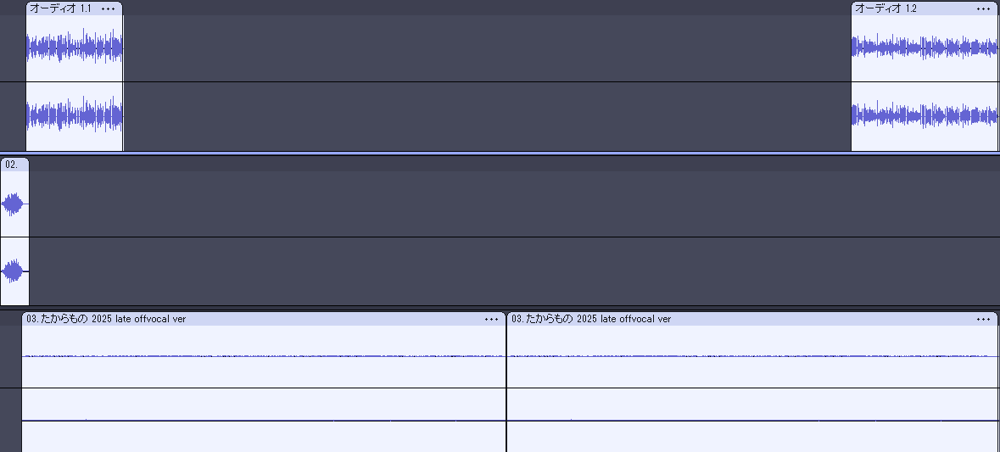

# 毎日Podcastを配信する
著者は2025年11月から毎日Podcastを配信しています。この章ではどうやったら毎日Podcastを配信できるのか？を紹介します。

## 毎日配信しているPodcast
執筆時点では次のPodcastを毎日配信しています。また、社外に公開はしていませんが、平日の毎日会社内でPodcastを配信しています。

#### aozorafm
https://fortegp05.github.io/aozorafm/

#### 技書博ラジオ
https://open.spotify.com/show/0yIsnO6w69uYbSoJGZjC1u?si=337c537a818c4edd

## どうやって毎日配信するのか？
これは「どうやって毎日配信するのか？」ではなく「毎日配信するにはどうすればいいのか？」を考えました。

### 短くする
Podcastは短くて30分、1時間くらいがちょうどいいと思っていました。しかし、冷静に考えると長さにルールはありません。別に30秒で終わっても30時間やってもPodcastと言えるはずです。では、長さは誰が決めているのか？というと配信者です。つまり **毎日配信できる長さ** にすればよいのです。著者の場合は3～5分程度としました。

### 楽をする
Podcastの説明やハッシュタグの紹介などの定型文は毎回同じことを喋ることになります。これは長さにもよりますが、予め録音しておくことで定型文を喋る労力を無くすことができます。他にも編集や配信を定型化したり自動化することで楽をすることができます。

図の通り、技書博ラジオでは予め録音しておいた定型文やジングル、BGMをセットしたファイルを作成しておき、録音したメイントピックを貼り付けるだけで完成するように工夫しています。この工夫で編集が非常に楽ができるようになりました。

### 簡単にする
録音が3分でも、編集して配信するのに1時間かかっていたら意味がありません。楽をするにも繋がりますが、編集作業が楽になるようになるべく同じ条件や環境で録音するようにしています。これは実際に録音から配信までをやってみて、面倒や無駄だなと思う部分を簡単にしていきます。

## 毎日配信すること自体より可能なことが重要
実際にやってみて思いましたが、毎日配信する事自体はそんなに重要ではありません。もう3ヶ月以上は毎日配信していますが、劇的にリスナーが増えたりバズったわけではありません。

では、なにか重要かというと毎日配信できるくらいPodcast配信を日常にできたことです。毎日配信なんて無理だと思っていた思い込みを乗り越え、どうすればいいのか？の考え方にたどり着き、実際に100日以上も毎日配信できたのは、バズることよりも得難い体験となりました。
