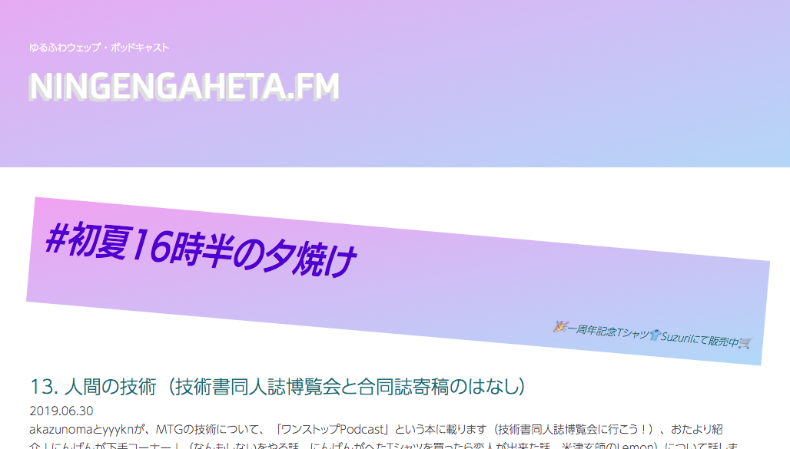
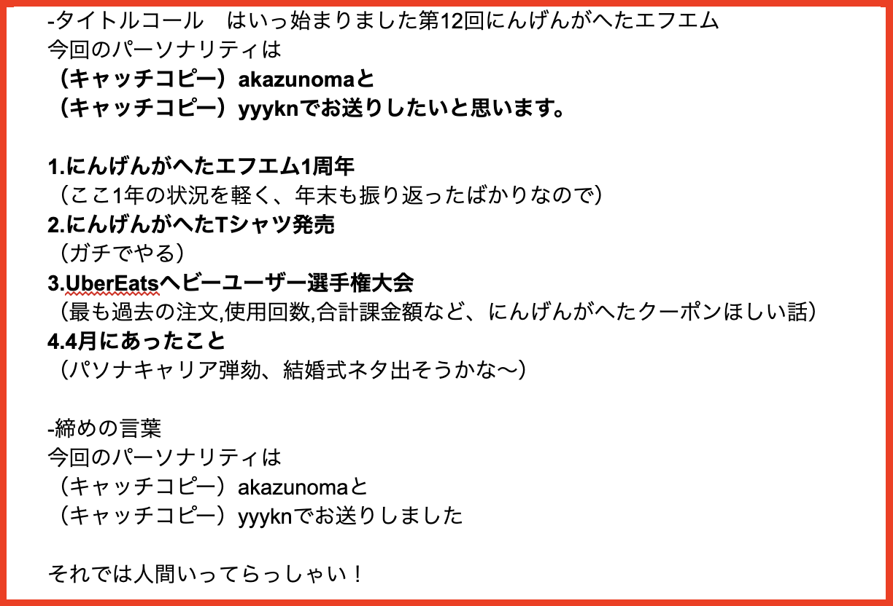
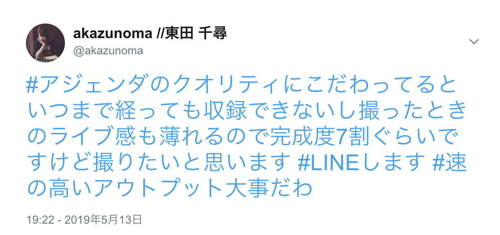
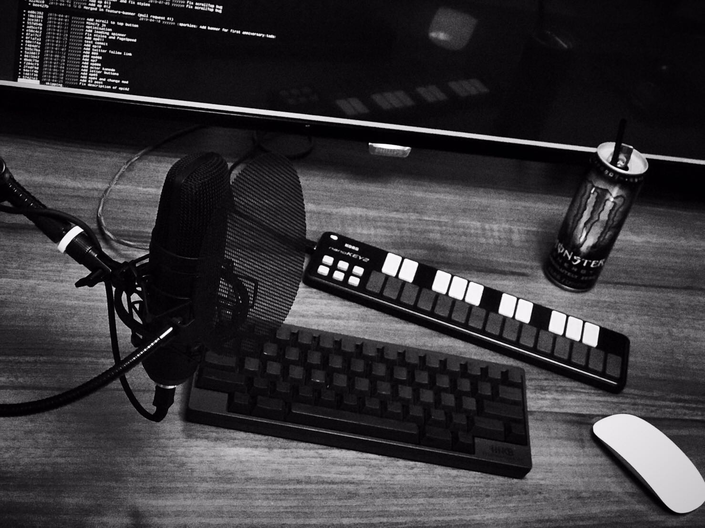

# ネタ切れ対策　～テーマの枯渇・テーマの探し方～

こんにちは、にんげんがへたエフエムをやっているよく喋る方、Webディレクターのakazunomaです。



Podcastをやりたいと思っているけど、ネタが思いつかない…

Podcastをやっているけど、そろそろネタが尽きてきたし、もう考える気力がわかない…

こんなお悩み、ありませんか？

「何を伝えたいか」「何を話すべきか」何をするにしても難しいテーマですよね。この「テーマが分からない沼」にハマると大変です。パーソナリティが悩みながら試行錯誤し、あれやこれをし、配信スパンが落ち、更新しなくなる…そして残ったのは更新が1年前のドメイン。そんな展開が見えます。

この章ではそんな悲しい展開を救うべく、主に「テーマの探し方」「テーマの枯渇」この観点を元に、にんげんがへたエフエムではどのようにやっているのかという点についてお話したいと思います。

幸いながらにんげんがへたエフエム（以下にんげんがへた）ではネタが枯渇することなく1年以上にわたって隔月スパンで安定的な配信ができています。メインパーソナリティとしてakazunomaとyyyknの2人で回していますが、主にアジェンダ（配信内容、話すネタ）を考えているのはakazunomaです。

参考までに第12回の実際のアジェンダを載せたいと思います。




基本的な構成は

 * タイトルコール
 * 話すネタ2〜3本
 * 締めの言葉

という三軸です。

話すネタの本数は、イベントなどの事情により増えますが、基本は3つ、という方針にしています。
たまにタイトルの前にちょっとした雑談が入るのも特徴ですね。

## タイトルコールとキャッチコピーについて

まず最初の**タイトルコール**についてご説明しましょう。

まず始まり方については人それぞれだと思いますが、普通に挨拶をします。

＞はいっ始まりましたにんげんがへたエフエム！

この点については各々のエフエムさんらしく言いやすさ重視かなと思いますが、注目していただきたいのはその次、にんげんがへた特有の「（キャッチコピー）」ですね。

当初、キャッチコピーという要素は存在しておらず、他のエフエムさんも聞いた結果「こんにちは、Webディレクターのakazunomaです」という感じでサッパリ挨拶をする予定でした（その方がスマートでかっこいいのでは？という印象）ただ、akazunomaはアイドルやVtuberが好きなので「みんなのハートをいただき〜ま○ゆ♡」とか「はいどーもぉ！キズ○アイです！」みたいな定番挨拶をやってみたいなという考えがありました（これはyyyknにも言ったことがなく、本誌での発言が初です）

全12回のakazunomaとyyyknの開始キャッチコピーは以下のような感じです。

タイトル

キャッチコピー内容　という順で以下に記載します。

```
01. 人間が下手ゾーン
　キャッチコピー無し
02. 人間がていねい
　フルーツを朝食に食べるのはやめよう、yyyknと
　糖質制限ダイエッターのakazunomaでお送りしたいと思います
03. 人間アップデート
　にんげんの形を保つことが困難！akazunomaと
　輪郭線がふにゃふにゃの、yyyknです
04. 人間が生きる
　ガチり倒すが今期のテーマ、akazunomaと
　肉体人類はパブリックエネミー、yyyknでお送りしたいと思います
05. 人間が夏
　自律神経がガパガパガパオライス、akazunomaと
　自炊をすればするほど肥えるタイプ、yyyknでお送りします
06. 人間エトセトラ
　カップラーメンの海老を2倍にしたものが食べたい、akazunomaと
　おなかいっぱいになってきた、yyyknでお送りします
07. 人間がエモ
　あなたのWebサイトのSEOが気になる！akazunomaと
　ハーゲンダッツのリッチミルクがめちゃくちゃ美味い、yyyknでお送りします
08. 人間がぐだぐだ
　東京都目黒区に引っ越しました、akazunomaと
　強度の強い人間ってなんだろう、yyyknでお送りしたいと思います
09. 人間ニューイヤー
　ありがとう2018年、akazunomaと
　可処分時間は有限です、yyyknでお送りしております
10. 人間成分
　毎日楽しく社会、akazunomaと
　デスクの上のモンエナの空き缶の数が人権と反比例しています、yyyknでお送りしたいと思います
11. 人間社会
　何年経っても出社が困難、社会人5年目！Webディレクターのakazunomaと
　出社は才能、yyyknでお送りしたいと思います
12. 人間元年
　ここ1年で人間がやわらかくなった気がする！akazunomaと
　髪をバッサリ切りました、yyyknでお送りしたいと思います
```

全体的に統一性が無くカオスですね。
基本的には近況や座右の銘になっています。
どこにいったんだ「みんなのハートをいただき○ゆゆ♡」

キャッチコピーを入れてみたらみたで毎度考えるのもめんどくさいし、定番化するのも難しいし、毎回話すテーマに合わせて変えているので実は結構な手間です。
しかし、何かしらの「近況」や自分の「座右の銘」を入れることで、その後にもうひとりのパーソナリティであるyyyknがそこで話題を深掘りしてくれるというメリットに気がつきました。逆にakazunomaが「それどういうこと？」と聞くこともあります。
カオスとは逆に「突っ込みがい」があるということです。突っ込みがいのあるカオスさは、ときに珠玉のテーマとなってくれます。
カオス感の演出にキャッチコピーを入れてみると話があたたまっていいかもしれません。


## メインネタについて

にんげんがへたではメインに話すネタは2~3本程度に絞っています。
年末や1周年などイベントにより増えたり減ったりする傾向にありますが、おおよそ2~3本で30分程度がリスナーにとって聞きやすいレベルかな、と考えているからです。
話す順番は

 1. 普通に聞いてほしいこと(10分）
 2. ガチで伝えたい重要ネタ(15分）
 3. 適当な話題(5分）

です。2番目に重要ネタを持ってきているのは、聞きたいことだけ聞いたら即離脱というユーザー行動を避けるため、バランスの良い真ん中に置いてみています。（恐らく作業中に聞いてくれているリスナーさんが多いので、今のところこの配置による早期離脱は起こっていません）この辺はエフエムさんのカラーによりトライアンドエラーを繰り返してみるのがおすすめです。

特にこのメインネタの選定が皆さんにとって話すのに困る部分かと思いますが、にんげんがへたでは下記のような基準で選定することがあります。

#### **季節ネタ**

定番です。春はあけぼの、やうやう白くなりゆく生え際…そんな風に季節について触れるのも雅ですが、「GWに読んだ技術書」や「夏祭りに感じたエモ」「春の新卒入社」そんな春夏秋冬のイベントについて話してみるのもおすすめです。
にんげんがへたでは2018年の年末に年越しPodcastをやったところ、PVが前回よりも増え、結果的にエフエムとしての知名度も上がりました。
最近だと改元があり、平成から令和へ変わる瞬間に何をやっていたか、改元がもたらしたものは何か、そういったネタも話しやすかったですね。「季節ネタ」というのはとにかく簡単で身近なネタなので、一見つまらなさそうに思えますが、逆に言えば誰でも身近であるため、共感を得られやすく喋りやすいテーマです。もし、季節ネタに悩むな〜ということであれば、季節イベントに合わせてネタを立てられるよう、配信スパンの見直しを入れてみるといいかもしれません。

#### **ランキングネタ**

にんげんがへたでは「2018年初夏欲しいものランキング」というネタをやったことがあります。akazunomaが欲しいものを3つ発表していくだけです。いわゆる商品紹介のようなテーマですが「自分はこれがほしいんだ」というモチベーションに基づいているため、誰でも話せるネタだと思います。単純に「○○が欲しいです」だけだと盛り上がりや優先順位といった部分に欠けるので、ランキング形式にしています。
派生形として

 * こんなアニメキャラが好き！私の性癖ランキング
 * 20XX年このスキルを手に入れたい！技術フレームワークランキング
 * この神奈川ラーメンが美味い20XX！

などが考えられるかなと思います。ちょっと無茶ぶりですがご当地ネタだと盛り上がりそうですね。もしにんげんがへたで次にネタが困ったら「2019年初夏欲しいものランキング」を配信する予定です。ずるいですが、一周すればいつでも使えるネタだなと感じています。

ちなみに「2018年初夏欲しいものランキング」の配信の後、ランキング内で発表していた

 * BRUNOホットプレート
 * Blue Microphones Yeti USBマイク

が家に届きました。今でもホットプレートでたこ焼きを作り、いただいたマイクで収録をしています。ありがとうございます。
みんな、欲しいものは積極的に言っていけ。

#### **選手権ネタ**

にんげんがへたでは「UberEatsヘビーユーザー選手権大会」というネタをやりました。単純に「お互いがどれだけUberEatsを使っているか」というのを競うだけのネタですが「選手権」というテーマは最後まで聞かないと結果（勝敗）が分からないため、テンポが良ければ離脱率が低いというデータがあります。
もっと簡単な競い合いでもいいかと思います

 * ローソンでもらったレシート枚数選手権
 * githubコミット数選手権
 * 睡眠時間選手権

この際突っ込みがいがあって「くだらねーｗｗｗ」と草が生えるほうが、話が広がるように思います。これもランキングと同じく使いまわしやすいネタです。


様々なPodcastで応用できそうなテーマ決めはこのあたりかな？と思います。
にんげんがへたにはもともと強固な「人間な下手な人がなんとかやっていくためのポッドキャスト」というコンセプトがあるので、そのコンセプトに助けられて話題が出てくることも多いです。話すネタに困るな、という場合はそもそものエフエムのコンセプトについて見直しを入れてみるのもいいかもしれません。

<div class="column">
<div class="column-title">おたよりをつかってみよう！</div>
外部からネタを集うのはとても良い方法です。にんげんがへたではおたよりボタンを設置し、Googleフォームに繋げていますが、定期的に良いネタを投稿してくれるリスナーさんに恵まれとても助けられています。もっと簡単にするなら質問箱やTwitterのハッシュタグなどもいいですね。
これはリスナーさんとパーソナリティの間に関係性が生まれてくるので「リスナーさんの身近な存在でありたい」と考えているパーソナリティの方にはとてもおすすめの手法です。エフエムメンバー以外の人からの意見というのは新鮮な視点を与えてくれるので、最近同じネタばかりになっちゃったな…というマンネリさを打破したいときにも使ってみてください。

</div>

## 雑さ、という大事さ

話すテーマに困っているときに「完璧なアジェンダ（台本）を仕上げなくちゃ」と考えていませんか。

にんげんがへたでは

 * アウトラインだけ決める（このあたりを話そう、という大枠）
 * アウトプットは雑でいい（完成度は60％、後はその場の雰囲気で決める）

というマインドセットの元でアジェンダを作成し収録を行っています



気持ち60％、高速なアウトプット、「とりあえずやってみた！」という達成感を大事にしていきたいですね。達成感を手に入れるのは継続への一番の近道です。

以上、「二人でPodcastをやっている」という前提で話を進めていましたが、基本的にPodcastは二人以上でやったほうが、会話形式でやりやすいのかなと考えています。
前述したキャッチコピーからの深掘りなど、そういうところは二人でPodcastをやっているメリットになりますね。また、基本的にakazunomaとyyyknは生活圏が被っていないので、普段の様子や最近の動向がうっすらとしか分かっていません。ですが、たまに家に飲みに行ったり一緒に年越ししたりもします。そういう「微妙に距離的に遠いけど関係性は近い他人」と一緒にPodcastをやるのが逆にいいかもしれません。


最後に、にんげんがへたエフエム的アジェンダテンプレートを置いておきます。
全てのアウトプットを頑張る皆さんへ、是非使ってみて下さい。

```
-タイトルコール　
はいっ始まりました第n回Podcastタイトル
今回のパーソナリティは
（キャッチコピー）氏名と
（キャッチコピー）氏名でお送りしたいと思います。

・普通に聞いてほしいこと(10分）
・ガチで伝えたい重要ネタ(15分）
・適当な話題(5分）

-締めの言葉
今回のパーソナリティは
（キャッチコピー）氏名と
（キャッチコピー）氏名でお送りしました。

-さよならの挨拶

```

みなさんどうでしたでしょうか。ご参考になりましたでしょうか。

もしテーマに困った！ここが辛い！にんげんがへた！などあればお気軽にhttp://ningengaheta.me/ のおたよりボタンからお知らせくださいませ。

akazunomaとyyyknがあなたの一歩を待っています。


それではみなさん、人間いってらっしゃい。


